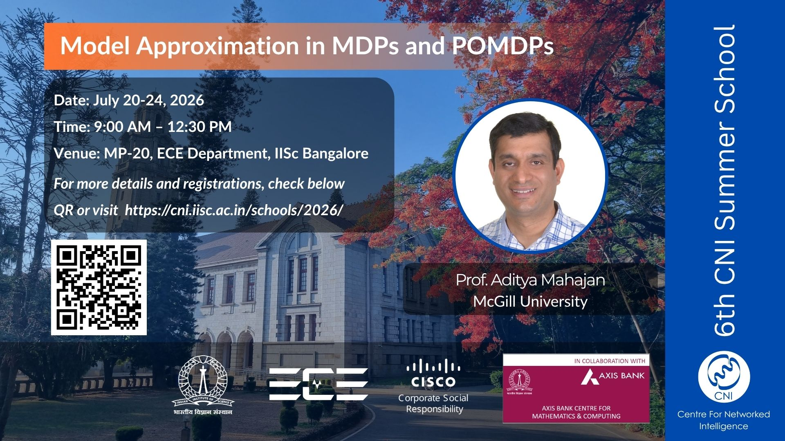

# Course outline {.unnumbered}

{fig-alt="CNI Summer School 2026 poster"}

These notes accompany the [CNI Summer School 2026](https://cni.iisc.ac.in/schools/2026/) on **Model approximation in MDPs and POMDPs**, hosted by the Centre for Networked Intelligence (CNI) at IISc Bengaluru.

This summer school focuses on model approximation techniques in Markov Decision Processes (MDPs) and Partially Observable Markov Decision Processes (POMDPs). The course introduces fundamental concepts in stochastic systems and optimization, followed by a structured treatment of decision-making under uncertainty using MDPs and POMDPs. It further explores approximation methods, sub-optimality bounds, and their connections to reinforcement learning. The program is designed for students, researchers, and practitioners interested in stochastic control, optimization, and learning in uncertain environments.

## Schedule {-}

| Lecture | Date | Time | Topic |
|--------:|:-----|:-----|:------|
| 1 | Mon 20 Jul | 9:00–10:30 | [Static stochastic optimization](lectures/static-optimization.qmd) |
| 2 | Mon 20 Jul | 11:00–12:30 | [Dynamic programming](lectures/dynamic-programming.qmd) |
| 3 | Tue 21 Jul | 9:00–10:30 | [MDP properties](lectures/MDP-properties.qmd) |
| 4 | Tue 21 Jul | 11:00–12:30 | [Model approximation](lectures/model-approximation.qmd) |
| 5 | Wed 22 Jul | 9:00–10:30 | [POMDP foundations](lectures/lecture-05.qmd) |
| 6 | Wed 22 Jul | 11:00–12:30 | [POMDP examples](lectures/lecture-06.qmd) |
| 7 | Thu 23 Jul | 9:00–10:30 | [Sub-optimality bounds](lectures/lecture-07.qmd) |
| 8 | Thu 23 Jul | 11:00–12:30 | [IPM-based bounds](lectures/lecture-08.qmd) |
| 9 | Fri 24 Jul | 8:30–9:30 | [Approximate information state](lectures/lecture-09.qmd) |
| 10 | Fri 24 Jul | 9:45–10:45 | [From bounds to reinforcement learning](lectures/lecture-10.qmd) |

: {tbl-colwidths="[10,18,18,54]" .striped}
