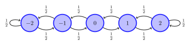
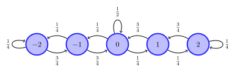

## Overview {.unnumbered}

In [Lecture 1](static-optimization.qmd) we consider single state (or static) stochastic optimization problems. In this lecture, we will consider multi-stage (or dynamic) stochastic optimization problems. To fix ideas, we start from a simple generalization of the newsvendor example.

## Motivating example: Inventory management

:::{#exm-inventory}
#### Inventory management

Consider a store selling appliances (say, refrigerators). It has $S_1$ units in its stock, and before the store opens it can procure $A_1$ appliances from a supplier at a cost of $p$ per unit. We assume that there is no lead time and the supplier immediately delivers the appliances. During the day, there is a demand of $W_1$. Let $S_2 = S_1 + A_1 - W_1$ denote the inventory at the end of the day.

If $S_2 > 0$, then the store has to keep that inventory in its warehouse, which incurs a cost of $c_h S_2$. If $S_2 < 0$, there is backlogged demand, which incurs a cost of $-c_s S_2$. We denote this cost by $h(S_2)$, where
$$ h(s) = \begin{cases} 
   c_h s, & \text{if } s \ge 0 \\
  -c_s s, & \text{if } s < 0
\end{cases}$$

The same process repeats on day 2. At the end of the second day, the store has incurred a total cost of
$$
C(S_{1:3}, A_{1:2}, W_{1:2}) = p A_1 + h(S_2) + p A_2 + h(S_3).
$$

Let $H_t = (S_{1:t}, A_{1:t-1}, W_{1:t-1})$ denote all the information available to the decision maker before taking action $A_t$. In general, the decision maker can choose $A_t = π_t(H_t)$. Thus, the performance of policy $π = (π_1, π_2)$ is given by
$$
  J(π) = \EXP^π[ C(S_{1:3}, A_{1:2}, W_{1:2}) ]
$$
where $\EXP^π[⋅]$ means that actions $A_t$ are chosen according to $π_t(H_t)$.

The retail store wants to choose a policy $π$ to minimize $J(π)$.
:::

The above problem is a functional optimization problem. We will now show that using ideas from the previous lecture, it can be converted into a sequence of parametric optimization problems. To keep the analysis manageable, we assume that 
$$
  S_1 = 0, \quad A_t \in \{5, 10\}, \quad W_t \in \{5, 10\} \text{ equally likely}
$$
and the cost parameters are
$$
  p = 1, \quad c_h = 2, \quad c_s = 5.
$$

We can represent this decision problem on a decision tree, shown in @fig-inventory-tree-full.

{#fig-inventory-tree-full}

## Backward dynamic programming on the tree

Recall the basic algorithm that we used in [Lecture 1](static-optimization.qmd).

- Start reducing the tree starting from the leaf nodes. 
- At chance nodes, average the values according to the probability of the alternatives.
- At decision nodes, choose the best alternative.

The same idea works in the dynamic setting, but needs to be repeated multiple times.

### Initialization: at the terminal step

To avoid introducing more notation, we denote the penultimate chance nodes as $(H_2, A_2)$ and define
$$
  Q^\star_2(h_2, a_2) = \EXP[ C(h_2, a_2, W_2) ].
$$

Visually, this is shown in @fig-inventory-tree-full-Q2

![Averaging at the penultimate chance nodes: each $W_2$-fan is replaced by
$Q^\star_2(h_2,a_2)=\EXP[C(h_2,a_2,W_2)]$.](figures/svg/inventory-tree-full-Q2.svg){#fig-inventory-tree-full-Q2}

### At the decision nodes at time $t=2$

Once the chance nodes are reduced, the penultimate node is a decision node. So, we choose the best alternative:
$$
  V^\star_2(h_2) = \min_{a_2} Q^\star_2(h_2, a_2),
  \qquad
  π^\star_2(h_2) \in \arg\min_{a_2} Q^\star_2(h_2, a_2).
$$
So we can remove the subtree starting from the penultimate nodes and attach value $V^\star_2(h_2)$ to the corresponding decision nodes. So, the tree folds, as shown in @fig-inventory-tree-full-V2.

{#fig-inventory-tree-full-V2}

### At the chance node at time $t=1$

Now the penultimate node is a chance node. So, we average over the values of $W_1$.
$$
  Q^\star_1(h_1, a_1) = \EXP\bigl[ V^\star_2(H_2) \bigr],
$$
where $H_2$ is the history reached after $(h_1, a_1, W_1)$. Again, we remove the subtree starting from the penultimate nodes and attach the value $Q^\star_1(h_1, a_1)$ to the corresponding decision nodes. So, the tree folds, as shown in @fig-inventory-tree-full-Q1.

![Averaging at the period-1 chance nodes: each $W_1$-fan is replaced by
$Q^\star_1(h_1,a_1)=\EXP[V^\star_2(H_2)]$.](figures/svg/inventory-tree-full-Q1.svg){#fig-inventory-tree-full-Q1}

### At the decision node at time $t=1$

Once the chance nodes are reduced, the penultimate node is a decision node. So, we choose the best alternative:
$$
  V^\star_1(h_1) = \min_{a_1} Q^\star_1(h_1, a_1),
  \qquad
  π^\star_1(h_1) \in \arg\min_{a_1} Q^\star_1(h_1, a_1).
$$

As before, this folds the tree, as shown in @fig-inventory-tree-full-V1.

{#fig-inventory-tree-full-V1}

### The optimal policy

Reading the optimal actions from the reduced tree gives the optimal policy $π^\star = (π^\star_1, π^\star_2)$, which can be visualized as shown in @fig-inventory-tree-policy.

{#fig-inventory-tree-policy}

Thus, by repeatedly applying the two basic steps from static optimization, we have converted the original functional optimization over policies to a sequence of parametric optimization problems.

## The general multi-stage model

The same idea applies for a general multi-stage stochastic optimization problem running for a finite horizon $T$. We present a general model, which can be viewed as an input-output system, with two inputs: a controlled input $A_t$ and a stochastic input $W_t$ and output $Y_t$. We assume that the system starts with a state of nature $W_0$, and that the decision maker (or agent) receives observations
$$
  Y_t = f_t(A_{1:t-1}, W_{0:t-1}), \quad t \ge 1
$$
for given sequence of functions $\{f_t\}_{t\ge 1}$. Thus, the sequential order in which the variables are realized is 
$$
  W_0 \;\to\; Y_1 \;\to\; A_1 \;\to\; W_1 \;\to\; Y_2 \;\to\; A_2 \;\to\; \cdots \;\to\; Y_T \;\to\; A_T \;\to\; W_T.
$$

The variables $\{W_0, \dots, W_T\}$ are called the **primitive random variables** of the system. We do **not** assume that they are independent: the joint law of $(W_0,\dots,W_T)$ may be arbitrary. All expectations below are therefore with respect to the **conditional** distribution of the next primitive given the information available so far.

We assume **perfect** observations. Thus, the agent has access to the history $H_t = (Y_{1:t}, A_{1:t-1}, W_{0:t-1})$ when taking an action. Note that $H_{t+1} = (H_t, Y_{t+1}, A_t, W_t)$, where $Y_{t+1} = f_t(A_{1:t}, W_{0:t})$. For simplicity of notation, we write this as
$$
  H_{t+1} = F_t(H_t, A_t, W_t).
$$

Let $O_T = (H_T, A_T, W_T)$ denote the **outcome** of the system. In the most general model we consider here, cost is incurred only at the end and may be written as a measurable function of that triple:
$$
  C(H_T, A_T, W_T).
$$

A **policy** is a sequence $π = (π_1, \dots, π_T)$ of maps with
$$
  A_t = π_t(H_t), \quad t \ge 1.
$$
We use $Π$ to denote the set of all such (history-dependent) policies. The performance of any policy $π \in Π$ is given by
\begin{equation} \label{eq:performance}
  J(π) = \EXP^π\bigl[ C(O_T) \bigr].
\end{equation}
The optimization problem is to find a policy that solves $\min_{π \in Π} J(π)$.

### Dynamic programming decomposition

1. The main decomposition algorithm that we discovered for @exm-inventory is called **dynamic programming (DP)**. It can be written succinctly as follows. 
   Initialize
   \begin{align}
     Q^\star_T(h_T, a_T) &= \EXP\bigl[ C(h_T, a_T, W_T) \bigm| H_T = h_T \bigr], \label{eq:QT-general} \\
     V^\star_T(h_T) &= \min_{a_T \in \ALPHABET A} Q^\star_T(h_T, a_T), \label{eq:VT-general} \\
     π^\star_T(h_T) &\in \arg\min_{a_T \in \ALPHABET A} Q^\star_T(h_T, a_T). \label{eq:piT-general}
   \end{align}
   And then for $t \in \{T-1, \dots, 1\}$, recursively compute
   \begin{align}
     Q^\star_t(h_t, a_t) &= \EXP\bigl[ V^\star_{t+1}\bigl(F_t(h_t, a_t, W_t)\bigr) \bigm| H_t = h_t \bigr], \label{eq:Qt-general} \\
     V^\star_t(h_t) &= \min_{a_t \in \ALPHABET A} Q^\star_t(h_t, a_t), \label{eq:Vt-general} \\
     π^\star_t(h_t) &\in \arg\min_{a_t \in \ALPHABET A} Q^\star_t(h_t, a_t). \label{eq:pit-general}
   \end{align}
   Equivalently, writing $P(\,\cdot\mid H_t = h_t)$ for the conditional law of $W_t$ given $H_t = h_t$,
   $$
     Q^\star_t(h_t, a_t)
     = \sum_{w} V^\star_{t+1}\bigl(F_t(h_t, a_t, w)\bigr)\, P(W_t = w \mid H_t = h_t),
   $$
   and likewise at time $T$ with $C(h_T,a_T,w)$ in place of $V^\star_{T+1}$.

2. Given any policy $π \in Π$, we can also evaluate its performance using **DP for policy evaluation**. It can be written as follows. Initialize
   \begin{align}
     Q^π_T(h_T, a_T) &= \EXP\bigl[ C(h_T, a_T, W_T) \bigm| H_T = h_T \bigr], \label{eq:QT-eval} \\
     V^π_T(h_T) &= Q^π_T\bigl(h_T, π_T(h_T)\bigr), \label{eq:VT-eval}
   \end{align}
   and then for $t \in \{T-1, \dots, 1\}$, recursively compute
   \begin{align}
     Q^π_t(h_t, a_t) &= \EXP\bigl[ V^π_{t+1}\bigl(F_t(h_t, a_t, W_t)\bigr) \bigm| H_t = h_t \bigr], \label{eq:Qt-eval} \\
     V^π_t(h_t) &= Q^π_t\bigl(h_t, π_t(h_t)\bigr). \label{eq:Vt-eval}
   \end{align}
   In particular, $J(π) = \EXP\bigl[ V^π_1(H_1) \bigr]$.

3. The main result is that the policy $π^\star = (π^\star_1, \dots, π^\star_T)$ obtained from the DP is optimal. This can be proved via backward induction by showing that
   $$
      V^{π^\star}_t(h_t) = V^\star_t(h_t) \le V^π_t(h_t), \quad \forall t, h_t, \forall π \in Π.
   $$

## Simplifications of the DP

The nested recursion above is valid in full generality. We now present some specializations that simplify the formulas.

### Independent primitive random variables

Suppose that the primitives $\{W_0,\dots,W_T\}$ are **independent** (but not necessarily identically distributed). Then the conditional law of $W_t$ given $H_t = h_t$ does not depend on the past:
$$
  P(W_t = w \mid H_t = h_t) = P(W_t = w).
$$
Consequently, every conditional expectation in the DP reduces to an ordinary expectation with respect to the marginal of $W_t$. In particular,
\begin{align*}
  Q^\star_T(h_T, a_T)
  &= \EXP\bigl[ C(h_T, a_T, W_T) \bigr],
  \\
  Q^\star_t(h_t, a_t)
  &= \EXP\bigl[ V^\star_{t+1}\bigl(F_t(h_t, a_t, W_t)\bigr) \bigr],
\end{align*}
and likewise for policy evaluation. Independence is the standing assumption in most classical MDP treatments; it is what justifies writing $\EXP[\,\cdot\,]$ without conditioning on $H_t$ in those formulas. The inventory tree in @fig-inventory-tree-full is already drawn under independent, equally likely demands.

### Additive per-step costs

In many applications, including inventory management, the cost is incurred at each time step. In particular, the terminal cost decomposes as a sum of per-step costs along the trajectory:
\begin{equation} \label{eq:additive-cost}
  C(O_T) = \sum_{t=1}^{T} c_t(H_t, A_t, W_t).
\end{equation}
For instance, in @exm-inventory, $c_t = p A_t + h(S_{t+1})$.

Each stage then contributes an **instantaneous** cost before the continuation. For such models, the DP simplifies further. To see that, we redraw the decision tree for the inventory management model with the per-step costs $c_t$ on the demand branches:

{#fig-inventory-tree-additive}

The DP decomposition proceeds as follows.
Initialize $V^\star_{T+1}(\cdot) \equiv 0$. For $t = T, \dots, 1$, and under independence of the primitives,
\begin{align}
  Q^\star_t(h, a)
    &= \EXP\bigl[ c_t(h, a, W_t)
         + V^\star_{t+1}\bigl(F_t(h, a, W_t)\bigr) \bigr],
  \label{eq:Qt-additive} \\
  V^\star_t(h)
    &= \min_{a \in \ALPHABET A} Q^\star_t(h, a),
  \label{eq:Vt-additive} \\
  π^\star_t(h)
    &\in \arg\min_{a \in \ALPHABET A} Q^\star_t(h, a).
  \label{eq:pit-additive}
\end{align}
Relative to the pure terminal-cost recursion, the only change is that $c_t(h,a,W_t)$ is charged at the current node (inside the same expectation as the continuation). Without independence, the same formulas hold with conditioning on $H_t = h$.

### State space models 

Suppose there is a process $\{S_t\}_{t \ge 1}$ taking values in a set $\ALPHABET S$ such that
\begin{equation}
  S_{t+1} = f_t(S_t, A_t, W_t),
  \qquad
  Y_t = S_t.
  \label{eq:state-space-model}
\end{equation}
Moreover, the total cost has an additive structure with the per-step cost $c_t \colon \ALPHABET S \times \ALPHABET A \times \ALPHABET W \to \reals$, i.e., 
$$
  C(O_T) = \sum_{t=1}^T c_t(S_t,A_t, W_t).
$$
Finally, the primitive random variables are independent.

For instance, the inventory management model considered above is of this form.

{#fig-inventory-tree-statespace}

Consider the two highlighted nodes in @fig-inventory-tree-statespace. They arise from different histories, but both have current state $S_2 = 0$. From either node, the same actions are available, the demand $W_2$ has the same law, the next state is generated by the same dynamics, and the remaining cost has the same form. Consequently, the two subtrees are identical.

Identical subtrees mean that the history-based action values agree: for every action $a$,
\begin{equation*}
  Q^\star_2(h,a) = Q^\star_2(h',a)
\end{equation*}
at those two histories $h$ and $h'$. Therefore the optimal values $V^\star_2(h) = V^\star_2(h')$ agree as well, and so do the optimal actions
\begin{equation*}
  π^\star_2(h) \in \arg\min_a Q^\star_2(h,a),
  \qquad
  π^\star_2(h') \in \arg\min_a Q^\star_2(h',a).
\end{equation*}
An optimal history-based policy may take the **same** action at every history that ends in the same stock. Equivalently: once the state is observed, the optimal decision is a function of the state alone.

::: {#thm-MDP-markov}
#### Optimal policies are Markov
In a state space model \eqref{eq:state-space-model} with additive cost \eqref{eq:additive-cost} and independent primitive random variables, the optimal action-value functions depend on $h_t$ only through the current state $s_t$:
\begin{equation*}
  Q^\star_t(h_t,a) = Q^\star_t(s_t,a).
\end{equation*}
Consequently,
$$
  V^\star_t(h_t) = V^\star_t(s_t)
  \quad\text{and}
  π^\star_t(h_t) = π^\star_t(s_t).
$$
Such policies are often called **Markov policies**.
:::

::: {.callout-note collapse="true"}
#### Proof of @thm-MDP-markov
Fix additive costs and dynamics $S_{t+1} = f_t(S_t,A_t,W_t)$. Proceed by backward induction on $t$.

At time $T$, the history recursion \eqref{eq:Qt-additive} gives
\begin{equation*}
  Q^\star_T(h_T,a)
  =
  \EXP\bigl[ c_T(S_T, a, W_T) \bigm| H_T = h_T,\, A_T = a \bigr].
\end{equation*}
The right-hand side depends on $h_T$ only through $S_T$, so $Q^\star_T(h_T,a) = Q^\star_T(s_T,a)$ and $V^\star_T(h_T) = V^\star_T(s_T)$.

Assume the claim holds at time $t+1$: $V^\star_{t+1}(h_{t+1}) = V^\star_{t+1}(s_{t+1})$. At time $t$,
\begin{equation*}
  Q^\star_t(h_t,a)
  =
  \EXP\Bigl[
    c_t(S_t,a,W_t)
    + V^\star_{t+1}(H_{t+1})
    \Bigm| H_t = h_t,\, A_t = a
  \Bigr].
\end{equation*}
Given $(S_t,A_t) = (s,a)$, the next state is $S_{t+1} = f_t(s,a,W_t)$, and by the induction hypothesis $V^\star_{t+1}(H_{t+1}) = V^\star_{t+1}(S_{t+1})$. Thus
\begin{equation*}
  Q^\star_t(h_t,a)
  =
  \EXP\Bigl[
    c_t(s,a,W_t)
    + V^\star_{t+1}\bigl(f_t(s,a,W_t)\bigr)
    \Bigm| S_t = s,\, A_t = a
  \Bigr],
\end{equation*}
which depends on $h_t$ only through $s$. Hence $V^\star_t(h_t) = V^\star_t(s_t)$ as well, and
\begin{equation*}
  π^\star_t(h_t) \in \arg\min_a Q^\star_t(s_t,a)
\end{equation*}
is a Markov choice. This completes the induction.

The same conclusion is an instance of [Blackwell’s principle of irrelevant information][blackwell]: once $S_t$ is known, the earlier coordinates of $H_t$ do not change the conditional law of the remaining cost-relevant variables $(W_t,\dots,W_T)$ and of the future states generated from $S_t$, so an optimal decision may ignore them.
:::

[blackwell]: static-optimization.qmd#thm-blackwell

Since $Q^\star_t$ and $V^\star_t$ are functions of the state, the history DP collapses to a recursion on $\ALPHABET S$.

Initialize $V^\star_{T+1}(s) \equiv 0$. For $t = T, T-1, \dots, 1$,
\begin{align}
  Q^\star_t(s,a)
  &= \EXP\Bigl[
    c_t(s, a, W_t)
    + V^\star_{t+1}\bigl(f_t(s,a,W_t)\bigr)
  \Bigr],
  \label{eq:bellman-Q}
  \\[0.5em]
  V^\star_t(s)
  &= \min_{a \in \ALPHABET A} Q^\star_t(s,a),
  \label{eq:bellman-V}
  \\[0.5em]
  π^\star_t(s)
  &\in \arg\min_{a \in \ALPHABET A} Q^\star_t(s,a).
  \label{eq:bellman-pi}
\end{align}

For a fixed Markov policy $π$, the same state recursion with $\min$ replaced by evaluation at $π_t(s)$ defines $V^π_t$ and $Q^π_t$:
\begin{align}
  Q^π_t(s,a)
  &=
  \EXP\Bigl[
    c_t(s, a, W_t)
    + V^π_{t+1}\bigl(f_t(s,a,W_t)\bigr)
  \Bigr],
  \label{eq:Qpi-state}
  \\
  V^π_t(s)
  &=
  Q^π_t\bigl(s, π_t(s)\bigr),
  \label{eq:Vpi-state}
\end{align}
with $V^π_{T+1} \equiv 0$. Equivalently,
\begin{equation} \label{eq:policy-eval}
  V^π_t(s) = \EXP\bigl[ c_t(s, π_t(s), W_t) + V^π_{t+1}\bigl(f_t(s, π_t(s), W_t)\bigr) \bigr].
\end{equation}

## Controlled Markov chains

A common alternative for state space models, especially with finite state and action spaces, is to model them as controlled Markov chains. To fix ideas, we start with an example.

:::{#exm-peak-control}
#### Peak control
Consider a _controlled_ Markov chain on $\ALPHABET S = \{-2, -1, 0, 1, 2\}$ with two actions, $\ALPHABET A = \{0, 1\}$. If action $A = 0$ is chosen, the chain evolves according to its "natural" dynamics:

{#fig-peak1}

When action $A = 1$ is chosen, the chain evolves according to the "forced" dynamics:

{#fig-peak2}

Under the natural dynamics, the chain settles to a uniform steady-state distribution; under the forced dynamics, it settles to a unimodal distribution peaked at state $0$.

Suppose it is desirable to keep the chain close to state $0$. We capture this by charging a _running cost_ $s^2$ in state $s$. Choosing $A=0$ is free, but choosing $A=1$ incurs a _correction cost_ $p$.

Thus the decision maker is in a conundrum. It may allow the system to follow its natural dynamics, which tends to reach states with larger absolute value and incur running cost $s^2$; or it may force the system toward state $0$, which reduces the running cost but incurs the correction cost $p$. How should it choose its actions?
:::

Such models are naturally cast as **controlled** Markov chains because $\{S_t\}_{t \ge 1}$ satisfies the controlled Markov property:
$$
  \PR(S_{t+1} = s_{t+1} \mid S_{1:t} = s_{1:t}, A_{1:t} = a_{1:t})
  = \PR(S_{t+1} = s_{t+1} \mid S_t = s_t, A_t = a_t).
$$
For finite state and action spaces, the right-hand side may be viewed as an entry of a **controlled transition matrix** $P_t(a_t)$. For instance, in @exm-peak-control we have
$$
\def\1{\tfrac 12}
P(0) = \MATRIX{ \1& \1&  0&  0&  0\\
                \1& 0 & \1&  0&  0\\
                0&  \1&  0&  \1& 0\\
                0&  0&  \1&   0& \1 \\
                0&  0&   0&  \1& \1}
\quad\text{and}\quad
\def\1{\tfrac 14}
\def\2{\tfrac 34}
\def\3{\tfrac 12}
P(1) = \MATRIX{ \1& \2&  0&  0&  0\\
                \1& 0 & \2&  0&  0\\
                0&  \1& \3&  \1& 0\\
                0&  0&  \2&   0& \1 \\
                0&  0&   0&  \2& \1}
$$
Since the model is time-homogeneous, we write $P(a)$ rather than $P_t(a)$.

In such models, it is common to model the per-step cost as $c_t(S_t, A_t)$ or $c_t(S_t, A_t, S_{t+1})$. For example, in @exm-peak-control, we have $c_t(s,a) = s^2 + pa$, while in @exm-inventory, we have $c_t(s,a,s') = p a + h(s')$.

This representation is compact and convenient for computational purposes, but I personally find it a bit opaque for proving the fundamental results of MDP theory. That is why we started with the **functional model**. However, we will use the controlled Markov chain representation when discussing structural properties of MDPs and approximation results.

## Examples {-}

Unfortunately, we won't have time to go into examples. But you are strongly encouraged to go over the following examples to become comfortable with MDP models:

- [Optimal gambling](https://adityam.github.io/stochastic-control/mdps/gambling.html)
- [Inventory management](https://adityam.github.io/stochastic-control/mdps/inventory-management.html)
- [Power control in wireless networks](https://adityam.github.io/stochastic-control/mdps/power-delay-tradeoff.html)

## Notes {-}

The inventory model is standard in operations research; see [the inventory management notes][mdps-inventory] for structural results (base-stock policies) and the post-decision state formulation.

The event-tree construction is classical in decision analysis; see
@Kuhn1950 and @Kuhn1953 for the introduction of information sets in
extensive-form games.

[mdps-inventory]: ../../mdps/inventory-management.qmd

## References {-}
