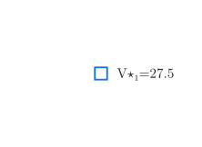

## Overview {.unnumbered}

In [Lecture 1](static-optimization.qmd) we consider single state (or static) stochastic optimization problems. In this lecture, we will consider multi-stage (or dynamic) stochastic optimization problems. To fix ideas, we start from a simple generalization of the newsvendor example.

## Motivaing example: Inventory management

:::{#exm-inventory}
#### Inventory management

Consider a store selling appliances (say, refridgerators). It has $S_1$ units in its stock, and before the store opens it can procure $A_1$ appliances from a supplier at a cost of $p$ per unit. We assume that there is no lead time and the supplier immediaely delivers the  appliances. During the day, there is a demand of $W_1$. Let $S_2 = S_1 + A_1 - W_1$ denote the inventory at the end of the day. 

If $S_2 > 0$, then the store has to keep than inventory in its warehouse, which incurs a cost of $c_h S_2$. If $S_2 < 0$, there is backlogged demand, which incurs a cost of $-c_s S_2$. We denote this cost by $h(S_2)$, where
$$ h(s) = \begin{cases} 
   c_h s, & \text{if } s \ge 0 \\
  -c_s s, & \text{if } s < 0
\end{cases}$$

The same process repeats on day 2. At the end of the second day, the store has incurred a total cost of
$$
C(S_{1:3}, A_{1:2}, W_{1:2}) = p A_1 + h(S_2) + p A_2 + h(S_3).
$$

Let $H_t = (S_{1:t}, A_{1:t-1}, W_{1:t-1})$ denote all the information available to the decision maker before taking action $A_t$. In general, it can choose $A_t = π_t(H_t)$. Thus, the performance of policy $π = (π_1, π_2)$ is given by
$$
  J(π) = \EXP^π[ C(S_{1:3}, A_{1:2}, W_{1:2}) ]
$$
where $\EXP^π[⋅]$ means that actions $A_t$ are chosen accoring to $π_t(H_t)$. 

The retail store wants to choose a policy $π$ to minimize $J(π)$.
:::

The above problem is a functional optimization problem. We will now show that using ideas from the previous lecture, it can be converted into a sequence of parameteric optimization problems. To keep the analysis manageable, we assume that 
$$
  S_1 = 0, \quad A_t \in \{5, 10\}, \quad W_t \in \{5, 10\} \text{ equally likely}
$$
and the cost parameters are
$$
  p = 1, \quad c_h = 2, \quad c_2 = 5.
$$

We can represent this decision problem on a decision tree, shown in @fig-inventory-tree-full.

{#fig-inventory-tree-full}

## Backward dynamic programming on the tree

Recall the basic algorithm that we used in [Lecture 1](static-optimization.qmd).

- Start reducing the tree starting from the leave nodes. 
- At chance nodes, average the values according to the probability of the alternatives.
- At decision nodes, choose the best alternative.

The same idea works in the dynamic setting, but needs to be repeated multiple times.

### Intialization: at the terminal step

To avoid introducing more notation, we denote the penultimate chance nodes as $(H_2, A_2)$ and define
$$
  Q^\star_2(h_2, a_2) = \EXP[ C(h_2, a_2, W_2) ].
$$

Visually, this is shown in @fig-inventory-tree-full-Q2

![Averaging at the penultimate chance nodes: each $W_2$-fan is replaced by
$Q^\star_2(h_2,a_2)=\EXP[C(h_2,a_2,W_2)]$.](figures/svg/inventory-tree-full-Q2.svg){#fig-inventory-tree-full-Q2}

### At the decision nodes at time $t=2$

Once the chance nodes are reduced, the penultimate node is a decision node. So, we choose the best alternative:
$$
  V^\star_2(h_2) = \min_{a_2} Q^\star_2(h_2, a_2),
  \qquad
  π^\star_2(h_2) \in \arg\min_{a_2} Q^\star_2(h_2, a_2).
$$
So we can remove the subtree starting from the penultimate nodes and attach value $V^\star_2(h_2)$ to the corresponding decision nodes. So, the tree folds, as shown in @fig-inventory-tree-full-V2.

{#fig-inventory-tree-full-V2}

### At the chance node at time $t=1$

Now the penultimate node is a chance node. So, we average over the values of $W_1$.
$$
  Q^\star_1(h_1, a_1) = \EXP\bigl[ V^\star_2(H_2) \bigr],
$$
where $H_2$ is the history reached after $(h_1, a_1, W_1)$. Again, we remove the subtree starting from the penultimate nodes and attach the value $Q^\star_1(h_1, a_1)$ to the corresponding decision nodes. So, the tree folds, as shown in @fig-inventory-tree-full-Q1.

![Averaging at the period-1 chance nodes: each $W_1$-fan is replaced by
$Q^\star_1(h_1,a_1)=\EXP[V^\star_2(H_2)]$.](figures/svg/inventory-tree-full-Q1.svg){#fig-inventory-tree-full-Q1}

### At the decision node at time $t=1$

Once the chance nodes are reduced, the penultimate node is a decision node. So, we choose the best alternative:
$$
  V^\star_1(h_1) = \min_{a_1} Q^\star_1(h_1, a_1),
  \qquad
  π^\star_1(h_1) \in \arg\min_{a_1} Q^\star_1(h_1, a_1).
$$

As before, this folds the tree, as shown in @fig-inventory-tree-full-V1.

{#fig-inventory-tree-full-V1}

### The optimal policy

Reading the optimal actions from the reduced tree gives the optimal policy $π^\star = (π^\star_1, π^\star_2)$, which can be visualized as shown in @fig-inventory-tree-policy.

{#fig-inventory-tree-policy}

Thus, by repeatedly applying the two basic steps from static optimization, we have converted the original functional optimaization over policies to a sequence of parameteric optimization problems.

## The general multi-stage model

The same idea applies for a general multi-stage stochastic optimization problem running for a finite horizon $T$. We present a general model, which can be viewed as an input-output system, with two inputs: a controlled input $A_t$ and a stochastic input $W_t$ and output $Y_t$. We assume that the system starts with state of nature $W_0$ and from decision maker or the agent receives observations
$$
  Y_t = f_t(A_{1:t-1}, W_{0:t-1}), \quad t \ge 1
$$
for given sequence of functions $\{f_t\}_{t\ge 1}$. Thus, the sequential order in which the variables are realized is 
$$
  W_0 \;\to\; Y_1 \;\to\; A_1 \;\to\; W_1 \;\to\; Y_2 \;\to\; A_2 \;\to\; \cdots \;\to\; Y_T \;\to\; A_T \;\to\; W_T.
$$

The variables $\{W_0, \dots, W_T\}$ are called the **primitive random variables** of the system. [Our standing assumption is that these are **independent** (but not necessarily identically distributed).]{.mark}

We assume **perfect** observations. Thus, the agent has access to the history $H_t = (Y_{1:t}, A_{1:t-1}, W_{0:t-1})$ when taking an action. Note that $H_{t+1} = (H_t, Y_{t+1}, A_t, W_t)$, where $Y_{t+1} = f_t(A_{1:t}, W_{1:t})$. For simplicity of notation, we write this as
$$
  H_{t+1} = F_t(H_t, A_t, W_t).
$$

Let $O_T = (H_T, A_T, W_T)$ denote the **outcome** of the system. We assume that cost $C(O_T)$ is incurred for outcome $O_T$. 

The **outcome** $O_T$ is the full realized trajectory (equivalently, $(H_T, A_T, W_T)$). In the most general model we consider here, cost is incurred only at the end and may be written as a measurable function of that triple:
$$
  C(H_T, A_T, W_T).
$$

A **policy** is a sequence $π = (π_1, \dots, π_T)$ of maps with
$$
  A_t = π_t(H_t), \quad t \ge 1.
$$
We use $Π$ to denote the set of all such (history-dependent) policies. The performance of any policy $π \in Π$ is given by
\begin{equation} \label{eq:performance}
  J(π) = \EXP^π\bigl[ C(O_T) \bigr].
\end{equation}
The optimization problem is to find a policy that solves $\min_{π \in Π} J(π)$.

### Dynamic programming decomposition

1. The main decomposition algorithm that we discovered for @exm-inventory is called **dynamic programming (DP)**. It can be written succinctly as follows. 
   Initialize
   \begin{align}
     Q^\star_T(h_T, a_T) &= \EXP\bigl[ C(h_T, a_T, W_T) \bigr], \label{eq:QT-general} \\
     V^\star_T(h_T) &= \min_{a_T \in \ALPHABET A} Q^\star_T(h_T, a_T), \label{eq:VT-general} \\
     π^\star_T(h_T) &\in \arg\min_{a_T \in \ALPHABET A} Q^\star_T(h_T, a_T). \label{eq:piT-general}
   \end{align}
   And then for $t \in \{T-1, \dots, 1\}$, recursively compute
   \begin{align}
     Q^\star_t(h_t, a_t) &= \EXP\bigl[ V^\star_{t+1}\bigl(F_t(h_t, a_t, W_t)\bigr) \bigr], \label{eq:Qt-general} \\
     V^\star_t(h_t) &= \min_{a_t \in \ALPHABET A} Q^\star_t(h_t, a_t), \label{eq:Vt-general} \\
     π^\star_t(h_t) &\in \arg\min_{a_t \in \ALPHABET A} Q^\star_t(h_t, a_t). \label{eq:pit-general}
   \end{align}

2. Given any policy $π \in Π$, we can also evaluate its performance using **DP for policy evaluation**. It can be written as follows. Initialize
   \begin{align}
     Q^π_T(h_T, a_T) &= \EXP\bigl[ C(h_T, a_T, W_T) \bigr], \label{eq:QT-eval} \\
     V^π_T(h_T) &= Q^π_T\bigl(h_T, π_T(h_T)\bigr), \label{eq:VT-eval}
   \end{align}
   and then for $t \in \{T-1, \dots, 1\}$, recursively compute
   \begin{align}
     Q^π_t(h_t, a_t) &= \EXP\bigl[ V^π_{t+1}\bigl(F_t(h_t, a_t, W_t)\bigr) \bigr], \label{eq:Qt-eval} \\
     V^π_t(h_t) &= Q^π_t\bigl(h_t, π_t(h_t)\bigr). \label{eq:Vt-eval}
   \end{align}
   In particular, $J(π) = \EXP\bigl[ V^π_1(H_1) \bigr]$.

3. The main result is that the policy $\pi^\star = (\pi^\star_1, \dots, \pi^\star_T)$ obtained from the DP is optimal. This can be proved via backward induction by showing that
   $$
      V^{\pi^\star}_t(h_t) = V^\star_t(h_t) \le V^\pi_t(h_t), \quad \forall t, h_t, \forall \pi \in \Pi.
   $$

## Additive per-step costs

Many applications (including inventory) do not wait until the end to charge cost. Suppose the terminal cost factors as a sum of per-step costs along the trajectory:
\begin{equation} \label{eq:additive-cost}
  C(H_T, A_T, W_T) = \sum_{t=1}^{T} c_t(H_t, A_t, W_t).
\end{equation}

The nested structure is unchanged, but each stage now contributes an **immediate** cost before the continuation. Initialize $V^\star_{T+1}(\cdot) \equiv 0$. For $t = T, \dots, 1$,
\begin{align}
  Q^\star_t(h, a)
    &= \EXP\bigl[ c_t(h, a, W_t)
         + V^\star_{t+1}\bigl(F_t(h, a, W_t)\bigr) \bigr],
  \label{eq:Qt-additive} \\
  V^\star_t(h)
    &= \min_{a \in \ALPHABET A} Q^\star_t(h, a),
  \label{eq:Vt-additive} \\
  π^\star_t(h)
    &\in \arg\min_{a \in \ALPHABET A} Q^\star_t(h, a).
  \label{eq:pit-additive}
\end{align}
Relative to the pure terminal-cost recursion \eqref{eq:Qt-general}, the only change is that $c_t(h,a,W_t)$ is charged at the current node (inside the same expectation as the continuation). Equivalently, one can absorb the remaining sum $\sum_{τ=t}^{T} c_τ(H_τ, A_τ, W_τ)$ into a terminal cost at stage $t$ and recover \eqref{eq:Qt-general}; additivity simply makes that decomposition explicit stage by stage.

On the inventory tree, this is exactly what we computed: at $t=2$ the leaf costs are $c_2$; at $t=1$ the root $Q^\star_1$ adds $c_1$ to the already-optimized $V^\star_2(S_2)$.

## State space models and MDPs

The history-based DP above is always valid, but the number of histories typically grows exponentially in $T$. Look back at the inventory tree: **two different paths led to $S_2 = 0$, and the subtrees rooted there were identical** (@fig-inventory-tree-statespace). Once the stock on hand is known, the earlier path that produced it does not matter for the remaining problem.

That observation is the idea of a **state**. A variable $S_t$ is a state at time $t$ when it is a **sufficient summary** of the history $H_t$: the future evolution of cost and observations depends on the past only through $S_t$. In inventory, $S_t$ is simply the current stock. In general, $S_t$ may be any quantity computed from $H_t$ with this sufficiency property.

{#fig-inventory-tree-statespace}

This is the defining feature of a **state space model** (Markov decision process): there is a state variable $S_t$ such that

1. the future evolution depends on the past only through $S_t$;
2. the optimal action at time $t$ depends only on $S_t$.

Formally, a (finite-horizon) **state space model** is specified by:

- a state space $\ALPHABET S$;
- an action space $\ALPHABET A$;
- a disturbance space $\ALPHABET W$;
- **dynamics** $S_{t+1} = f_t(S_t, A_t, W_t)$;
- **per-step costs** $c_t(S_t, A_t, W_t)$ (or $c_t(S_t, A_t, S_{t+1})$).

In the language of the general model, the observation is the state itself ($Y_t = S_t$), and the history update collapses to the state update: knowing $S_t$ renders the finer details of $H_t$ irrelevant for both dynamics and cost from time $t$ onward. The timing is shown in @fig-timing-ssm: at each period the state is observed, the action is chosen, nature draws the disturbance, and the next state is generated.

{#fig-timing-ssm width=70%}

The inventory model is a state space model with $f_t(s,a,w) = s + a - w$ and cost \eqref{eq:inv-cost}. The primitive random variables are the initial state $S_1$ and the i.i.d.\ demands $W_1, \dots, W_T$, which fall under the standing independence assumption above.

The objective in this special case is the expected sum of per-step costs
\begin{equation} \label{eq:finite-horizon-objective}
  J(π) = \EXP\Biggl[ \sum_{t=1}^T c_t(S_t, A_t, W_t) \Biggr].
\end{equation}

:::{.callout-tip}
#### Two representations

MDPs are often presented as **controlled Markov chains** via transition matrices $P_t(a)$. That representation is compact for computation but can obscure the proofs of structural results. We work primarily with the **functional representation** $S_{t+1} = f_t(S_t, A_t, W_t)$, following [the MDP notes][mdps-intro].
:::

[mdps-intro]: ../../mdps/intro.qmd

### How DP collapses from histories to states

In the general additive recursion \eqref{eq:Qt-additive}--\eqref{eq:pit-additive}, the arguments of $Q^\star_t$ and $V^\star_t$ are full histories $h$. Under the state space structure, if two histories $h$ and $h'$ share the same current state $s$, then:

- $S_{t+1} = f_t(s, a, W_t)$ depends on the past only through $(s, a)$, and the expectation over $W_t$ is the same at both histories;
- the per-step cost depends on $(s, a, w)$ alone;
- by backward induction, $V^\star_{t+1}$ depends on the next history only through $S_{t+1}$.

Consequently $Q^\star_t(h,a)$ and $V^\star_t(h)$ depend on $h$ only through $s$, and we may write $Q^\star_t(s,a)$ and $V^\star_t(s)$. This is precisely the identification visible in @fig-inventory-tree-statespace: the event tree is the **unfolding** of the state space model, and states label histories that lead to the same remaining subproblem.

| Event tree | State space model |
|:-----------|:------------------|
| Node = (time, full history) | Node = (time, state) |
| Exponential growth in $T$ | Polynomial in $\lvert \ALPHABET S \rvert$, $\lvert \ALPHABET A \rvert$, $T$ |
| Backward DP = collapse subtrees | Backward DP = Bellman recursion on $S_t$ |
| Lecture 1 idea at each history | Lecture 1 idea at each state |

## Markov policies suffice

With a state $S_t$ in hand, one might still consider policies that depend on the full history:
$$
  A_t = π_t(S_{1:t}, A_{1:t-1}).
$$
Such **history-dependent** policies are very general. The first structural result of MDP theory says that this generality is unnecessary.

::: {#thm-MDP-markov}
#### Optimality of Markov policies
For the state space model above, there is no loss of optimality in restricting to **Markov policies**
$$
  A_t = π_t(S_t), \quad t = 1, \dots, T.
$$
:::

The proof repeatedly applies [Blackwell's principle of irrelevant information][blackwell] from Lecture 1: once $S_t$ is known, the rest of the history is irrelevant for choosing $A_t$.

[blackwell]: static-optimization.qmd#thm-blackwell

::: {#lem-two-step}
#### Two-step lemma
Consider an MDP with horizon $T = 2$. For any fixed $π_1$, there is no loss of optimality in choosing $A_2 = π_2(S_2)$.
:::

::::{.callout-note collapse="true"}
#### Proof
Fix $π_1$. Minimizing $J(π)$ over $π_2$ is equivalent to minimizing $\EXP[c_2(S_2, π_2(S_{1:2}, A_1), W_2)]$. Apply @thm-blackwell with $S = S_2$, $Y = (S_1, A_1)$, $W = W_2$, and $A = A_2$.
::::

The general proof (@thm-MDP-markov) proceeds by induction: first show $π_T$ can be taken Markov, then $π_{T-1}$, and so on. See [the MDP notes][mdps-intro] for the three-step lemma and the full argument.

## Policy evaluation

Before optimizing, we need to evaluate a given Markov policy $π = (π_1, \dots, π_T)$. Define the **cost-to-go** (or **value**) functions
$$
  V^π_t(s) = \EXP^π\Biggl[ \sum_{τ=t}^{T} c_τ(S_τ, A_τ, W_τ)
  \;\Biggm|\; S_t = s \Biggr].
$$
These satisfy the **policy evaluation** recursion: initialize $V^π_{T+1}(s) \equiv 0$ and, for $t = T, T-1, \dots, 1$,
\begin{equation} \label{eq:policy-eval}
  V^π_t(s) = \EXP\bigl[ c_t(s, π_t(s), W_t) + V^π_{t+1}\bigl(f_t(s, π_t(s), W_t)\bigr) \bigr].
\end{equation}

On the event tree, \eqref{eq:policy-eval} is exactly the operation of collapsing a subtree to a single number: what we did when we replaced each period-2 fan by $V^\star_2(h_2)$ in @fig-inventory-tree-full-V2. In the general history-based model, the same idea applies with $s$ replaced by $h$; the MDP assumption is what lets us index value functions by $S_t$ alone.

For the controlled Markov chain representation, the recursion becomes $V^π_t = c^π_t + P^π_t V^π_{t+1}$ in vector form; see [the MDP notes][mdps-intro] for details and the peak-control example.

## The dynamic programming decomposition

We now specialize the additive nested recursion to states. Define **optimal** action-value and value functions recursively: initialize $V^\star_{T+1}(s) = 0$ and, for $t = T, \dots, 1$,
\begin{align}
  Q^\star_t(s, a) &= \EXP\bigl[ c_t(s, a, W_t) + V^\star_{t+1}\bigl(f_t(s,a,W_t)\bigr) \bigr],
  \label{eq:bellman-Q} \\
  V^\star_t(s) &= \min_{a \in \ALPHABET A} Q^\star_t(s,a),
  \label{eq:bellman-V} \\
  π^\star_t(s) &\in \arg\min_{a \in \ALPHABET A} Q^\star_t(s,a).
  \label{eq:bellman-pi}
\end{align}
When the per-step cost is written as a function of $(S_t, A_t, S_{t+1})$, replace $c_t(s,a,W_t)$ by $c_t\bigl(s,a,f_t(s,a,W_t)\bigr)$; inventory uses either form via \eqref{eq:inv-cost}.

::: {#thm-DP}
#### Dynamic programming decomposition
The policy $π^\star = (π^\star_1, \dots, π^\star_T)$ defined by \eqref{eq:bellman-pi} is optimal for \eqref{eq:finite-horizon-objective}. Moreover, $V^\star_1(s)$ is the optimal expected total cost starting from $S_1 = s$.
:::

The backward pass on the inventory tree *was* this recursion for $T=2$:

- @fig-inventory-tree-full-V2 computed \eqref{eq:bellman-Q}–\eqref{eq:bellman-V} at $t=2$;
- @fig-inventory-tree-full-Q1 computed them at $t=1$ with $V^\star_{2}$ attached.

Equations \eqref{eq:bellman-Q}–\eqref{eq:bellman-pi} are the state-indexed special case of the additive history recursion \eqref{eq:Qt-additive}–\eqref{eq:pit-additive}, which in turn specializes the terminal-cost nesting \eqref{eq:QT-general}–\eqref{eq:pit-general}.

### The comparison principle and Bellman's principle of optimality

Rather than proving @thm-DP directly, we use a comparison principle.

::: {#thm-comparison}
For any Markov policy $π$ and any $t$, $V^π_t(s) \ge V^\star_t(s)$, with equality if and only if $π_{t:T}$ satisfies the verification step \eqref{eq:bellman-pi} at time $t$.
:::

The proof is backward induction on $t$; see [the MDP notes][mdps-intro]. @thm-comparison immediately implies that the policy obtained from \eqref{eq:bellman-Q}–\eqref{eq:bellman-pi} is optimal.

:::{.callout-important}
#### Bellman's principle of optimality
An optimal policy has the property that whatever the initial state and the initial decisions are, the remaining decisions must constitute an optimal policy with regard to the state resulting from the first decision.
:::

On the event tree, this says: if you follow an optimal policy and arrive at a state $S_t = s$ at time $t$, the actions you take from $t$ onward must be optimal for the subtree rooted at $s$. Backward DP implements this principle systematically.

## Looking ahead

Lecture 3 develops MDP foundations further: more examples, structural properties, and algorithms (value iteration, policy iteration). The dynamic program \eqref{eq:bellman-Q}–\eqref{eq:bellman-pi} is the baseline against which all approximations will be measured. When the state is not directly observed, the same nested logic applies with histories (or suitable **information states**) in place of $S_t$; that is the road to POMDPs later in the course.

## Exercises {-}

::: {#exr-inventory-tree}
#### Inventory DP by hand

For the two-period inventory instance in @exm-inventory, verify the
$Q^\star_2$, $V^\star_2$, $Q^\star_1$, and $V^\star_1$ values in the tables and confirm that
the optimal policy matches @fig-inventory-tree-policy.
:::

::: {#exr-inventory-T3}
#### One more period

Extend the instance to $T = 3$ with the same data and $S_1 = 0$.
Compute $V^\star_3$, $V^\star_2$, and $V^\star_1$ at $s = 0$ using the Bellman
recursion.  *(You may use a computer for this one.)*
:::

::: {#exr-markov-policy}
#### Why history does not help at $t=2$

For the $T=2$ inventory model, give an explicit example of a
history-dependent policy $π_2(S_1, A_1, S_2)$ that is **not** Markov
but has the same expected cost as the optimal Markov policy.  Explain
why this does not contradict @thm-MDP-markov.
:::

::: {#exr-policy-eval}
#### Policy evaluation

For the inventory instance with $T=2$, fix the policy $π_1(0) = 5$,
$π_2(0) = π_2(-5) = 10$, $π_2(5) = 5$.  Compute $V^π_2(s)$ for
$s \in \{-5, 0, 5\}$ and then $V^π_1(0)$ using
\eqref{eq:policy-eval}.
:::

::: {#exr-cost-next-state}
#### Cost depending on the next state

Suppose the per-step cost is $c_t(S_t, A_t, S_{t+1})$ and the objective
is $\EXP[\sum_t c_t(S_t, A_t, S_{t+1})]$.  Define
$\tilde c_t(s,a) = \EXP[c_t(s,a,f_t(s,a,W_t))]$.  Show that minimizing
the original objective is equivalent to minimizing
$\EXP[\sum_t \tilde c_t(S_t, A_t)]$, and derive the Bellman recursion
for $Q^\star_t(s,a)$.
:::

## Notes {-}

The inventory model is standard in operations research; see
[the inventory management notes][mdps-inventory] for structural results (base-stock policies) and the
post-decision state formulation.

@thm-MDP-markov and @thm-DP are the finite-horizon foundations of MDP
theory. The comparison principle (@thm-comparison) is due to Bellman and
underlies the principle of optimality.

The event-tree construction is classical in decision analysis; see
@Kuhn1950 and @Kuhn1953 for the introduction of information sets in
extensive-form games. 

[mdps-inventory]: ../../mdps/inventory-management.qmd

## References {-}

## Stuff

Reading the tree:

- At the root the decision maker chooses $A_1 \in \{5, 10\}$.
- Nature draws $W_1$; this determines the period-1 cost and the next stock
  $S_2 = S_1 + A_1 - W_1$.
- At each $S_2$-node the decision maker chooses $A_2$; nature draws
  $W_2$; the leaf is labeled with the total path cost $C$.

The four period-1 paths and their next stocks are:

| $A_1$ | $W_1$ | $S_2$ |
|:-----:|:-----:|:-----:|
| $5$ | $5$ | $0$ |
| $5$ | $10$ | $-5$ |
| $10$ | $5$ | $5$ |
| $10$ | $10$ | $0$ |

Notice that **two different paths lead to $S_2 = 0$**.  We will return to this coincidence after developing the general history-based model.

## From one stage to many stages

Recall the single-stage problem with observation $S$ and primitive outcome $W$:
$$
  \min_{π \in Π} \EXP\bigl[ c(S, π(S), W) \bigr].
$$
The policy optimization procedure from Lecture 1 showed that this is solved by computing action-value functions $Q(s,a) = \EXP[c(s,a,W)\mid S=s]$ and taking
$$
  π^\star(s) \in \arg\min_{a} Q(s,a)
$$
at each information state.

When there are $T$ stages, the decision maker chooses a sequence of actions $A_1, \dots, A_T$, each based on whatever has been observed so far. The objective is still an expected cost, but now the cost can depend on the entire trajectory, and early actions affect both immediate outcomes and the information available later.

