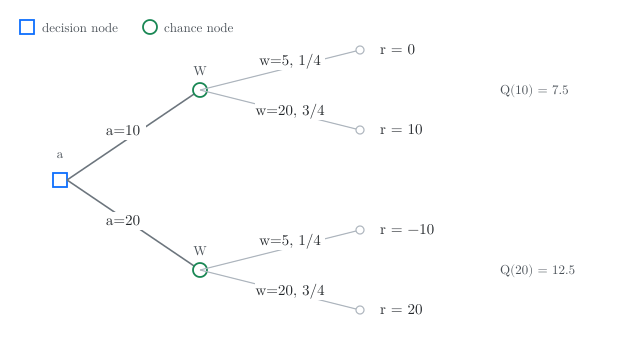
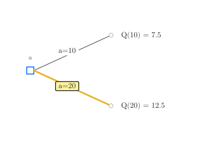
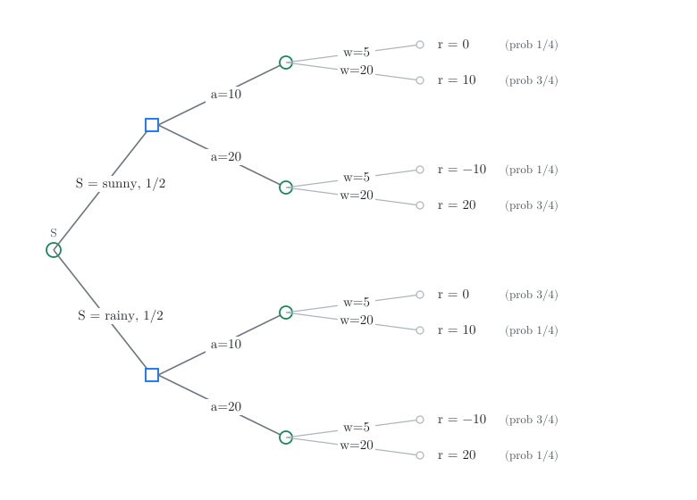
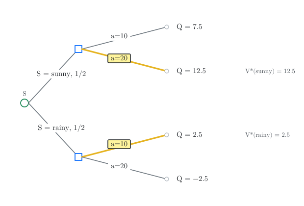
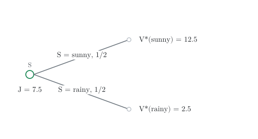

Stochastic control is the study of sequential decision-making under uncertainty. Because these problems span various applications, their foundational theory has been developed across multiple disciplines, including systems and control, operations research, economics, and artificial intelligence. Consequently, the literature often uses different terminology and notation. While classical theory focuses on exploiting structural simplifications when the system model is perfectly known, a vast literature addresses the computational challenges of complex systems under the headings of approximate dynamic programming and reinforcement learning. In this course, we focus on model approximation, a specific subclass of these methods, with a core emphasis on deriving rigorous theoretical guarantees.

We begin by peeling back the "sequential" layer to focus on the single-stage (or static) decision problem: how to choose an action to minimize an expected cost that depends on a random outcome. We will address three fundamental questions:

1. How should a decision maker act when the outcome is uncertain?
2. How should a decision maker use partial observations before acting?
3. Which observations can be safely ignored without loss of optimality?

The answers we develop here, namely *certainty equivalence*, the *interim view*, and *Blackwell's principle of irrelevant information*, are the core building blocks that we will reuse throughout the course when we treat MDPs and POMDPs.

## Stochastic optimization

Let us start with the simplest optimization problem. A decision maker has to choose an action $a \in \ALPHABET A$, and incurs a cost $c(a)$ that depends only on that action:
\begin{equation} \label{eq:det} \tag{P-Det}
  \min_{a \in \ALPHABET A} c(a).
\end{equation}
When $\ALPHABET A$ is finite, we can (in principle) enumerate the values $c(a)$ and pick the smallest.  When $\ALPHABET A$ is continuous, the problem is tractable only under regularity conditions (e.g., convexity of $c$).

Now suppose that the cost also depends on some **random variable** $W \in \ALPHABET W$, whose distribution is known to the decision maker.  The decision maker chooses $a$ *before* $W$ is observed, incurs a cost $c(a,W)$, and is assumed to be **risk-neutral** so that they minimize the expected cost:
\begin{equation} \label{eq:soc} \tag{P-Stoc}
  \min_{a \in \ALPHABET A} \EXP\bigl[ c(a, W) \bigr].
\end{equation}

Define $Q(a) = \EXP[c(a,W)]$. Then problem \eqref{eq:soc} is *conceptually* the same as \eqref{eq:det}: it is still a minimization over $a$ of a deterministic function $Q$.  The computational difficulty is that evaluating $Q(a)$ now requires computing an expectation.

:::{.callout-tip}
#### Cost vs.\ reward

In some settings it is more natural to maximize a reward $r(a,W)$ instead of minimizing a cost.  The two formulations are equivalent (put $c = -r$), so we pick whichever is more natural in the given context.
:::

We begin with some examples to illustrate how to solve \eqref{eq:soc}, depending on how the cost function is structured.

## Example: The newsvendor problem

:::{#exm-newsvendor}
#### The newsvendor problem
Each morning, a newsvendor has to decide how many newspapers to buy before knowing the demand during the day. Newspapers are bought at $\$p$ per copy and sold at $\$q$ per copy, where $q > p$. Any unsold newspapers at the end of the day have no salvage value.

Let $a$ denote the number of newspapers bought and $W$ denote the demand. If $W < a$, the newsvendor sells $W$ newspapers and earns $qW - pa$; if $W \ge a$, the newsvendor sells $a$ newspapers and earns $qa - pa$.  The reward is $r(a,W)$ where
\begin{equation} \label{eq:newsvendor-reward}
r(a, w) =
\begin{cases}
   q w - p a, & \text{if } w < a, \\
   q a - p a, & \text{if } w \ge a.
\end{cases}
\end{equation}
:::

### Decision trees

When $\ALPHABET S$ and $\ALPHABET A$ are discrete, the simplest way to visualize stochastic optimization problems is using decision trees. As a concrete example, take prices $p = 1$, $q = 2$, action set $\ALPHABET A = \{10, 20\}$, and demand supported on $\ALPHABET W = \{5, 20\}$ with
$$
  \PR(W = 5) = \tfrac{1}{4}, \quad \PR(W = 20) = \tfrac{3}{4}.
$$
The four reward values are then
$$
  r(10,5)=0, \quad r(10,20)=10, \quad r(20,5)=-10, \quad r(20,20)=20.
$$

The optimization problem \eqref{eq:soc} can be visualized as a *decision tree* shown in @fig-newsvendor-tree-basic:

{#fig-newsvendor-tree-basic width=80%}

We use the following convention:

- a decision node (blue square) denotes nodes at which the decision maker acts.
- a chance node (green circle) denotes the nodes at which nature acts.
- the leaves are labelled by the realized reward $r(a,W)$.

In this simple problem, the tree has three layers: starting with decision node, then a chance node, and then the leaf nodes. Computing $Q(a)$ amounts to *simplifying the tree*. We start from the leave nodes, and go towards the root node. 

- At a chance node, we average the values according to the probabilities.
- At a decision node, we pick an action to minimize (or maximize) the values.

So, for the tree shown in @fig-newsvendor-tree-basic, we simplify the chance nodes to get
\begin{align*}
  Q(10) &= \tfrac{1}{4}(0) + \tfrac{3}{4}(10) = 7.5, \\
  Q(20) &= \tfrac{1}{4}(-10) + \tfrac{3}{4}(20) = 12.5.
\end{align*}
This yields the reduced tree in @fig-newsvendor-tree-basic-simplified. Now we simplify the decision node to pick the value with the larger action to get $a^\star = 20$. 

{#fig-newsvendor-tree-basic-simplified width=55%}

### The continuous version

To build intuition beyond enumeration, suppose that both actions and demand are continuous.  Let $f$ be the PDF and $F$ the CDF of the demand.  The expected reward is
\begin{equation} \label{eq:Q-newsvendor}
  Q(a) = \int_{0}^{a} (qw - pa)\, f(w)\, dw
       + \int_{a}^{\infty} (qa - pa)\, f(w)\, dw.
\end{equation}
A direct computation shows that $d^2 Q(a)/da^2 = -q f(a) \le 0$, so $Q$ is *concave*.  Setting the derivative equal to zero and using Leibniz's rule yields the following classical result.

::::{.callout-note collapse="true"}
#### Detailed derivation

::: {.callout-tip}
#### Leibniz integral rule
$$
  \dfrac{d}{dx} \left( \int_{p(x)}^{q(x)} f(x,t)\, dt \right)
  = f(x, q(x)) \cdot \dfrac{d}{dx} q(x)
  - f(x, p(x)) \cdot \dfrac{d}{dx} p(x)
  + \int_{p(x)}^{q(x)} \dfrac{\partial}{\partial x} f(x,t)\, dt.
$$
:::

To verify that $Q$ is concave, compute the second derivative:
$$
  \frac{d^2 Q(a)}{da^2} = - p f(a) - (q - p) f(a) = -q f(a) \le 0.
$$

Using the Leibniz integral rule, the derivative of the first term of \eqref{eq:Q-newsvendor} is
$$
  [q a - p a ] f(a) + \int_{0}^a [ -p ] f(w)\, dw
  = [q a - p a ] f(a) - p F(a).
$$
Similarly, the derivative of the second term of \eqref{eq:Q-newsvendor} is
$$
  - [q a - p a] f(a) + \int_{a}^{\infty} (q-p)f(w)\,dw
  = - [q a - p a] f(a) + (q - p)[ 1 - F(a)].
$$
Combining the two, we get
$$
  \dfrac{dQ(a)}{da} = - p F(a) + (q - p) [ 1 - F(a) ].
$$
Equating this to $0$, we get
$$
  F(a) = \dfrac{ q - p }{ q}
  \quad\text{or}\quad
  a = F^{-1} \left( 1 - \dfrac{  p }{ q } \right).
$$
::::

::: {#prp-newsvendor-cts}
For the newsvendor problem with continuous demand, the optimal action is
$$
  a^\star = F^{-1}\!\left( 1 - \frac{p}{q} \right).
$$
The quantity $1 - p/q$ is called the **critical fractile**.
:::

The graphical interpretation is elegant: *draw the CDF of the demand; the optimal action is the point at which the CDF crosses the horizontal line $1 - p/q$*.  Two special cases illustrate the formula.

:::{#exm-newsvendor-exponential}
If $W$ is exponential with mean $θ$, then $F(w) = 1 - e^{-w/θ}$ and
$$
  a^\star = θ \log(q/p).
$$
:::

:::{#exm-newsvendor-uniform}
If $W$ is uniform on $[0,M]$, then $F(w) = w/M$ and
$$
  a^\star = M\bigl(1 - p/q\bigr).
$$
:::

### The discrete version

For a general finite demand alphabet $\ALPHABET W = \{w_1 < w_2 < \cdots < w_k\}$ with PMF $\{μ_1, \dots, μ_k\}$.  The argument based on derivatives no longer applies, but the *finite-difference* analogue works: comparing $Q(w_{i+1})$ and $Q(w_i)$ gives the following counterpart of @prp-newsvendor-cts.

::: {#prp-newsvendor-discrete}
Let $F$ denote the CDF of the demand, so that
$$
  F(w_i) = μ_1 + \cdots + μ_i.
$$
The optimal action is the largest $w_i$ such that
$$
  F(w_i) \le 1 - \frac{p}{q}.
$$
:::

::::{.callout-note collapse="true"}
#### Detailed derivation

Write $F_i \coloneqq F(w_i)$ as shorthand. The expected reward for choice $w_i$ is
\begin{align*}
  Q(w_i)
  &= \sum_{j < i} μ_j [ q w_j - p w_i ] + \sum_{j \ge i} μ_j [q w_i - p w_i]
  \\
  &= -p w_i + q \Bigl[ \sum_{j < i}  μ_j w_j + \sum_{j \ge i} μ_j w_i \Bigr].
\end{align*}
Thus,
\begin{align*}
  Q(w_{i+1}) - Q(w_i)
  &= -p w_{i+1} + q \Bigl[ \sum_{j < i+1}  μ_j w_j + \sum_{j \ge i+1} μ_j w_{i+1} \Bigr]
  \\
  &\quad + p w_i - q \Bigl[ \sum_{j < i}  μ_j w_j + \sum_{j \ge i} μ_j w_i \Bigr]
  \\
  &= -p (w_{i+1} - w_i) + q \Bigl[ \sum_{j \ge i + 1} μ_j ( w_{i+1} - w_i) \Bigr]
  \\
  &= \bigl( - p + q [ 1 - F_i ] \bigr) (w_{i+1} - w_i).
\end{align*}
Note that
$$
  F_i \le \dfrac{q-p}{q}
  \iff
  -p + q [ 1 - F_i ] \ge 0.
$$
Thus, for all $i$ such that $F_i \le (q-p)/q$, we have $Q(w_{i+1}) \ge Q(w_i)$. On the other hand, for all $i$ such that $F_i > (q-p)/q$, we have $Q(w_{i+1}) < Q(w_i)$. Therefore the optimal amount to order is the largest $w_i$ such that $F(w_i) \le (q-p)/q$.
::::

The graphical interpretation is identical to the continuous case: the optimal action is where the step CDF crosses $1 - p/q$.

### Acting based on historical data

In practice, the distribution $F$ of the demand is not known; only a data set $\ALPHABET D_K = \{w^{(1)}, \dots, w^{(K)}\}$ of past demands is available.  A simple *certainty equivalence* approach is to replace $F$ by the empirical CDF
$$
  \hat{F}_K(w) = \frac{1}{K} \sum_{k=1}^K \IND\{w^{(k)} \le w\}
$$
and to solve the corresponding empirical problem
$$
  \max_{a \in \ALPHABET A}
    \frac{1}{K} \sum_{k=1}^K r(a, w^{(k)}).
$$
This simple idea is known by different names in the literature: **certainty equivalence** in adaptive control, **empirical risk minimization (ERM)** in machine learning, and **sample average approximation (SAA)** in optimization.

The structure of the optimal solution established in @prp-newsvendor-cts and @prp-newsvendor-discrete implies that the optimal action is the $ρ$-th quantile of the demand distribution, where $ρ = 1 - p/q$ is the critical fractile. To obtain that, order the historical demands as
$$
  w^{(1:K)} \le w^{(2:K)} \le \cdots \le w^{(K:K)}.
$$
Then the certainty-equivalent action is $w^{(\lceil ρ K \rceil:K)}$. This is the **non-parametric approach**: it makes no assumption about the form of the demand distribution.

If instead we know that demand follows a specific parametric family, we can estimate its parameters from $\ALPHABET D_K$. For example, if demand is exponential with unknown mean $θ$, an unbiased estimator is the sample mean
$$
  \hat{θ}_K = \frac{1}{K} \sum_{k=1}^K w^{(k)}.
$$
Given @exm-newsvendor-exponential, the certainty-equivalent action is
$$
  a = \hat{θ}_K \log(q/p).
$$
This is the **parametric approach**: it assumes a distributional form for the demand.

If the exponential assumption is correct, both approaches converge to the same limit, and for small samples the parametric approach is typically more efficient. If the assumption is wrong, the parametric approach can perform poorly, so the non-parametric approach is more robust.

:::{.callout-important}
#### A theme of the course

Certainty equivalence is the simplest instance of **model approximation**: we assume that demand comes from some distribution that we do not know, so we build a parametric or non-parametric model and use that model as a proxy for reality. In later lectures we will study *how well* such approximations perform, both in single-stage problems and in fully sequential problems.
:::

## Example: reliability of an MPSoC

:::{#exm-mpsoc-reliability}
Consider a Multi-Processor System on Chip (MPSoC) that requires at least one CPU and one RAM module to function properly. The chip has a total capacity for three components, so we can add redundancy to protect against component failure. There are two possible designs:

- **Design 1** uses two CPUs and one RAM;
- **Design 2** uses one CPU and two RAM modules.

The lifetimes of the CPU and RAM are independent and modeled as exponential random variables with parameters $λ_c$ and $λ_r$, respectively. When two identical components are present, they operate in **cold standby**: the backup activates only after the primary fails.  A subsystem fails only once both components have ceased to function.

Find the design that maximizes the expected lifetime (i.e., the mean time to failure) of the system.
:::

We map this into \eqref{eq:soc} by letting $W = (W^1_c, W^2_c, W^1_r, W^2_r)$ where $W^i_c$ and $W^i_r$ are the lifetimes of the $i$-th CPU and RAM, and $\ALPHABET A = \{1, 2\}$. The system lifetime under each design is
\begin{align*}
  r(1, W) &= \min\{ W^1_c + W^2_c,\, W^1_r \}, \\
  r(2, W) &= \min\{ W^1_c,\, W^1_r + W^2_r \},
\end{align*}
and the optimal design maximizes $Q(a) = \EXP[r(a,W)]$. It can be shown that
\begin{align*}
  Q(1) = \EXP[r(1, W)] &= \frac{2λ_c + λ_r}{(λ_c + λ_r)^2}, \\
  Q(2) = \EXP[r(2, W)] &= \frac{λ_c + 2λ_r}{(λ_c + λ_r)^2}.
\end{align*}
Thus **Design 1 is optimal iff $λ_c > λ_r$**, i.e., we should add redundancy to the *weakest* component (the one that fails faster).

::::{.callout-note collapse="true"}
#### Detailed derivation

Two facts from elementary probability suffice:

- If $X_1, X_2$ are independent exponential with parameter $λ$, then $X_1 + X_2 \sim \text{Gamma}(2,λ)$ and, in particular, $\PR(X_1+X_2 > t) = (1 + λ t) e^{-λ t}$.
- For non-negative independent random variables $X, Y$, $\EXP[\min\{X,Y\}] = \int_0^\infty \PR(X>t)\, \PR(Y>t)\, dt$.

Combined with the integrals $\int_0^\infty e^{-λ t}\,dt = 1/λ$ and $\int_0^\infty t e^{-λ t}\, dt = 1/λ^2$, we obtain
\begin{align*}
  \EXP[r(1, W)]
    &= \int_0^\infty (1 + λ_c t) e^{-(λ_c + λ_r) t}\, dt
     = \frac{2λ_c + λ_r}{(λ_c + λ_r)^2}, \\
  \EXP[r(2, W)]
    &= \int_0^\infty (1 + λ_r t) e^{-(λ_c + λ_r) t}\, dt
     = \frac{λ_c + 2λ_r}{(λ_c + λ_r)^2}.
\end{align*}
::::

## Stochastic optimization with observations

The problems so far assumed that the decision maker knows nothing beyond the prior distribution of $W$ before acting. In many applications the decision maker also observes some data that is informative about $W$. We begin with a concrete example, then abstract the general theory.

### The newsvendor with weather information

We return to the newsvendor problem and assume that the newsvendor has additional information before they order.

:::{#exm-newsvendor-info}
#### Weather-aware newsvendor
The model is the same as the model of @exm-newsvendor, but we assume that the demand distribution depends on the weather and that the newsvendor can observe the weather before making a decision:

Let $\ALPHABET S = \{\text{sunny}, \text{rainy}\}$ denote different possibilities of the weather with
$$
  \PR(S = \text{sunny}) = \PR(S = \text{rainy}) = \tfrac{1}{2}.
$$
Demand still takes values in $\{5, 20\}$, but now depends on the weather:
\begin{align*}
  \PR(W = 5 \mid S = \text{sunny})  &= \tfrac{1}{4},
  &\PR(W = 20 \mid S = \text{sunny})  &= \tfrac{3}{4}, \\
  \PR(W = 5 \mid S = \text{rainy}) &= \tfrac{3}{4},
  &\PR(W = 20 \mid S = \text{rainy}) &= \tfrac{1}{4}.
\end{align*}
(In particular, the sunny conditional law is exactly the demand law of the basic instance.)

Find the policy $π\colon \ALPHABET S \to \ALPHABET A$ that maximizes $\EXP[r(S, π(S), W)]$.
:::

The rewards are the same as in the basic instance above. There are only $|\ALPHABET A|^{|\ALPHABET S|} = 4$ policies to enumerate:

| Policy $π$ | $π(\text{sunny})$ | $π(\text{rainy})$ | $J(π)$ |
|:------------:|:-------------------:|:-------------------:|:--------:|
| $π_1$ | $10$ | $10$ | $5.00$ |
| $π_2$ | $10$ | $20$ | $2.50$ |
| $π_3$ | $20$ | $10$ | $7.50$ |
| $π_4$ | $20$ | $20$ | $5.00$ |

The optimal policy is $π_3$: **order 20 papers on sunny days and 10 on rainy days**.

But this brute-force enumeration is unsatisfying: it does not scale, and it does not reveal any structure. A decision-tree view suggests a better procedure.

### A tree representation

We already drew the basic newsvendor as a tree in @fig-newsvendor-tree-basic.  With an observation $S$, the same idea applies, but the decision node is no longer at the root: nature draws $S$ first, and only then does the decision maker act.

For @exm-newsvendor-info the resulting tree is @fig-newsvendor-tree-info. In particular, the sunny subtree is identical to @fig-newsvendor-tree-basic.

{#fig-newsvendor-tree-info width=100%}

Notice the structural feature: **each observation value $s$ opens a completely separate subtree**, and the two subtrees share no chance outcomes. We can therefore solve each weather subtree separately, exactly as in the basic newsvendor.

Since the newsvendor maximizes reward, define $Q(s, a) = \EXP[r(a,W) \mid S = s]$ and maximize over $a$ for each weather $s$. The sunny column reproduces the basic instance of @fig-newsvendor-tree-basic:
\begin{align*}
  Q(\text{sunny}, 10)  &= 7.5, && \text{computed earlier} \\
  Q(\text{sunny}, 20)  &= 12.5, && \text{computed earlier} \\
  Q(\text{rainy}, 10)  &= \tfrac{3}{4}(0) + \tfrac{1}{4}(10) = 2.5, \\
  Q(\text{rainy}, 20)  &= \tfrac{3}{4}(-10) + \tfrac{1}{4}(20) = -2.5.
\end{align*}
This is equivalent to averaging the penultimate chance nodes of @fig-newsvendor-tree-info to obtain a reduced tree shown in @fig-newsvendor-tree-info-simplified.

{#fig-newsvendor-tree-info-simplified width=75%}

Define the optimal value at the decision node and the optimal policy as
\begin{align*}
  V^\star(\text{sunny}) &= 12.5, & π^\star(\text{sunny}) &= 20, \\
  V^\star(\text{rainy}) &= 2.5, & π^\star(\text{rainy}) &= 10.
\end{align*}
Optimizing at each decision node collapses the tree one more step to @fig-newsvendor-tree-info-value. 

{#fig-newsvendor-tree-info-value width=60%}

Averaging at the root then gives the performance of the optimal policy
$$
  J(π^\star) = \tfrac{1}{2}(12.5) + \tfrac{1}{2}(2.5) = 7.5,
$$
which matches $π_3$ from the enumeration above. 

The same steps work in general: first form conditional action values $Q(s,a)$, then optimize separately for each observation. We now state this formally.

## The general model and policy optimization

### The general model

Let $W \in \ALPHABET W$ denote the "state of the world" and $S \in \ALPHABET S$ an **observation** that the decision maker sees before choosing an action.  The primitive random variables $(W, S)$ are defined on a common probability space and have a *known joint distribution*.  A **decision rule** (or **policy**) is a measurable map $$ π \colon \ALPHABET S \to \ALPHABET A, \quad A = π(S). $$ We write $Π$ for the set of all such policies.  Upon choosing the action $A = π(S)$, the decision maker incurs cost $c(S,A,W)$, and the expected cost of the policy $π$ is
$$
  J(π) = \EXP\bigl[\, c(S, π(S), W) \,\bigr].
$$
The stochastic optimization problem with observations is
\begin{equation} \label{eq:funcopt} \tag{P-Obs}
  \min_{π \in Π} J(π).
\end{equation}

:::{.callout-important}
#### Function optimization vs. parameter optimization

Problem \eqref{eq:soc} is a **parameter optimization** problem: the minimization is over a *point* $a \in \ALPHABET A$.

Problem \eqref{eq:funcopt} is a **function optimization** problem: the minimization is over a *function* $π \colon \ALPHABET S \to \ALPHABET A$.

Even when $\ALPHABET S$ and $\ALPHABET A$ are finite, this is a big increase in complexity: there are $|\ALPHABET A|^{|\ALPHABET S|}$ policies to compare, and each policy evaluation requires an expectation.  A brute-force search is infeasible even for modestly sized problems.

As the weather example showed, \eqref{eq:funcopt} can be reduced to a *collection* of parameter optimization problems \eqref{eq:greedy}, one per observation value $s$.
:::

### Policy evaluation and optimization

The weather example used an **interim view**: rather than picking a whole policy $π$ *before* seeing $S$ (the "ex ante" view), wait until $S = s$ is observed and then choose an action $a$ that optimizes the *conditional* expected cost. In general, define the **action-value function**
$$
  Q(s, a) \coloneqq \EXP\bigl[\, c(s, a, W) \,\bigm|\, S = s \,\bigr]
        = \sum_{w \in \ALPHABET W} \PR(W = w \mid S = s)\, c(s, a, w).
$$

The action-value functions can be used to evaluate the performance of a policy and identify the optimal policy:

1. **Policy evaluation.** For any policy $π \colon \ALPHABET S \to \ALPHABET A$, define the **policy-value function**
   $$
     V^π(s) = Q(s, π(s)).
   $$
   The value functions are related to performance:
   $$
      J(π)
      = \EXP\bigl[c(S,π(S),W)\bigr]
      = \EXP\Bigl[ \EXP\bigl[ c(S,π(S),W) \bigm| S \bigr] \Bigr]
      = \EXP\bigl[V^π(S)\bigr].
   $$

2. **Policy optimization.** Define the **optimal value function**
   $$
     V^\star(s) \coloneqq \min_{a \in \ALPHABET A} Q(s, a),
   $$
   and the **greedy policy**
   \begin{equation} \label{eq:greedy} \tag{P-Itm}
     π^\star(s) \in \arg\min_{a \in \ALPHABET A} Q(s, a),
   \end{equation}
   with ties broken arbitrarily. Then policy $π^\star$ is optimal.

   ::::{.callout-note collapse="false"}
   #### Proof
   Let $π$ be any arbitrary policy. Then,
   $$
     V^{π}(s) \stackrel{(a)}\ge V^\star(s) \stackrel{(b)}= V^{π^\star}(s)
   $$
   where $(a)$ follows from the definition of $V^\star$ and $(b)$ follows from the definition of $π^\star$ in \eqref{eq:greedy}. Taking expectation of both sides, we get
   $$
     J(π) \ge J(π^\star).
   $$
   Since $π$ was arbitrary, this implies that $π^\star$ is optimal.
   ::::

   ::::{.callout-warning collapse="true"}
   #### Measurable selection

   The proof implicitly assumes that $π^\star$ is a measurable policy. This is not always the case when $\ALPHABET S$ and $\ALPHABET A$ are continuous valued. Sufficient conditions to ensure that $π^\star$ are measurable are called **measurable selector theorems**.
   ::::

3. **Partial-converse**. Let $π^\circ$ be any optimal policy. Then, for any $s$ such that $\PR(S = s) > 0$, $π^\circ(s)$ must satisfy \eqref{eq:greedy}.

   ::::{.callout-note collapse="false"}
   #### Proof
   Suppose $π^\circ$ violates \eqref{eq:greedy} at some $s^\circ$ such that $\PR(S = s^\circ) > 0$, i.e, $V^{π^\star}(s^\circ) > V^\star(s^\circ)$. In the previous step, we have shown that every $s$ we still have $V^{π^\circ}(s) \ge V^\star(s)$. Since $\PR(S = s^\circ) > 0$, these inequalities imply
   $$
     J(π^\circ) = \EXP\bigl[V^{π^\circ}(S)\bigr] > \EXP\bigl[V^\star(S)\bigr] = J(π^\star),
   $$
   contradicting the previous result that $π^\star$ is optimal.
   ::::

:::{.callout-important}
#### The conceptual and computational simplification

Problem \eqref{eq:funcopt} is a functional optimization problem. Brute-force search requires comparing $|\ALPHABET A|^{|\ALPHABET S|}$ policies.

In contrast, Problem \eqref{eq:greedy} is a parameteric optimization problem. Find the optimal policy requires solving $|\ALPHABET S|$ separate optimization problems of size $|\ALPHABET A|$, which is a exponential reduction in complexity.

This is the key idea that we will generalize to dynamic programming decomposition for multi-stage stochastic optimization problems.
:::

## Blackwell's principle of irrelevant information

The policy optimization procedure told us how to *use* an observation optimally.  We now ask a complementary question: are there observations we can *safely ignore*? The answer, due to David Blackwell, is a beautifully clean *conditional independence* condition.

### A motivating example

Let us extend @exm-newsvendor-info by giving the newsvendor a second observation.

:::{#exm-newsvendor-blackwell}
#### Irrelevant observation
Alongside the weather $S \in \{\text{sunny}, \text{rainy}\}$, the newsvendor also observes which side of the bed he got out of, $Y \in \{\text{left}, \text{right}\}$. We assume that $Y$ is independent of $(S,W)$: getting out on the left or the right has nothing to do with the weather or the demand.

Formally, $(S, Y, W)$ are defined on a common probability space with
$$
  \PR(S=\text{sunny})=\PR(S=\text{rainy}) = \tfrac{1}{2}, \quad
  \PR(Y = \text{left}) = \PR(Y = \text{right}) = \tfrac{1}{2}, 
$$
with $Y \perp (S, W)$ and $\PR(W \mid S)$ is exactly as in @exm-newsvendor-info.

Find the policy $π \colon \ALPHABET S \times \ALPHABET Y \to \ALPHABET A$ that maximizes $\EXP[r(S, π(S, Y), W)]$.
:::

The tree corresponding to @exm-newsvendor-blackwell is @fig-newsvendor-tree-blackwell.  Nature draws $(S, Y)$ jointly; the decision maker sees both.  There are four decision nodes at depth 1 (one for each $(s, y)$ combination), and each has an identical $W\mid S$-subtree.

{#fig-newsvendor-tree-blackwell width=100%}

Two features of the tree stand out:

1. The two subtrees rooted at $(S = \text{sunny}, Y = \text{left})$ and $(S = \text{sunny}, Y = \text{right})$ are *structurally identical*: the conditional PMF of $W$ is the same, so the $Q$-values are the same: $$ Q(\text{sunny}, \text{left}, a) = Q(\text{sunny}, \text{right}, a), \quad a \in \ALPHABET A. $$ The same holds for the two "rainy" subtrees.
2. Consequently, an optimal policy exists that returns the same action at both $(s, \text{left})$ and $(s, \text{right})$ (i.e., a policy that depends only on $S$).

The dashed *information states* in the figure encode this graphically: the optimal policy can be chosen to be *constant on each information state*. There is no loss of optimality in ignoring $Y$.

The condition that makes this work is not that $Y$ is *independent* of $W$; it is the weaker condition that $Y$ is *conditionally* independent of $W$ given $S$.  Blackwell's theorem captures exactly this.

### The main result

::: {#thm-blackwell}
#### Blackwell's principle of irrelevant information

Let $\ALPHABET S, \ALPHABET Y, \ALPHABET W, \ALPHABET A$ be standard Borel spaces and $S \in \ALPHABET S$, $Y \in \ALPHABET Y$, $W \in \ALPHABET W$ random variables on a common probability space.

Consider a decision maker who observes $(S, Y)$ and chooses $A = π(S, Y)$ to minimize $\EXP[c(S, A, W)]$, where $c \colon \ALPHABET S \times \ALPHABET A \times \ALPHABET W \to \reals$ is measurable.

**If $Y$ is conditionally independent of $W$ given $S$, then there is no loss of optimality in choosing $A$ as a function of $S$ alone**: there exists $π^\star \colon \ALPHABET S \to \ALPHABET A$ such that
$$
  \EXP\bigl[c(S, π^\star(S), W)\bigr]
  \;\le\;
  \EXP\bigl[c(S, π(S, Y), W)\bigr]
  \quad \text{for every } π \colon \ALPHABET S \times \ALPHABET Y \to
  \ALPHABET A.
$$
:::

::::{.callout-note collapse="false"}
#### Proof
We prove the finite-alphabet case; the general Borel case follows by standard measurable-selection arguments (see @Blackwell1964).

Define the action-value function of the enlarged observation by
$$
  Q(s, y, a) \coloneqq \EXP\bigl[c(s, a, W) \bigm| S = s, Y = y\bigr].
$$
Because $Y \perp W \mid S$, the conditional law of $W$ given $(S,Y)$ depends on $S$ alone, so
$$
  Q(s, y_1, a) = Q(s, y_2, a)
  \quad\text{for all } y_1, y_2 \in \ALPHABET Y.
$$
In particular, $Q(s, y, a)$ does not depend on $y$, and we write $\bar Q(s,a)$ for its common value. The greedy policy for the enlarged problem may therefore be chosen independent of $Y$:
$$
  π^\star(s, y_1) = π^\star(s, y_2)
  \in \arg\min_{a \in \ALPHABET A} \bar Q(s, a)
  \quad\text{for all } y_1, y_2.
$$
Thus there is an optimal policy that is a function of $S$ alone.
::::

## Main takeaways {-}

1. **Stochastic optimization.** Conceptually, a static problem is elementary: for each candidate action $a$, compute the expected performance $Q(a) = \EXP[c(a,W)]$ and pick the best. The real difficulty is *computational*: evaluating those expectations may be hard, which is why approximations (including certainty equivalence) enter the picture.

2. **Policy optimization.** With observations, do the same thing *conditionally*: for each observation $s$, compute $Q(s,a)$ for every action and choose a greedy action. This reduces function optimization over policies to a collection of ordinary parameter optimizations, one per $s$.

3. **Blackwell's principle and information states.** An observation that is conditionally independent of $W$ given $S$ can be ignored without loss of optimality. Equivalently, decision nodes that share the same conditional law of $W$ form a single *information state*, and an optimal policy may act as a function of that information state alone.

## Exercises {-}

::: {#exr-mpsoc-four-components}
#### MPSoC with four components

Extend @exm-mpsoc-reliability to the case where the chip has a total capacity for four components. There are three possible designs:

- Design 1 uses three CPUs and one RAM;
- Design 2 uses two CPUs and two RAMs;
- Design 3 uses one CPU and three RAMs.

Find the design that maximizes the expected lifetime of the system.

*Hint*: If $X_1, X_2, X_3$ are i.i.d. exponential with parameter $λ$, then $\PR(X_1 + X_2 + X_3 > t) = \bigl(1 + λ t + (λ t)^2/2\bigr) e^{-λ t}$.  Moreover, $\int_0^\infty t^n e^{-λ t}\, dt = n!/λ^{n+1}$.
:::

::: {#exr-newsvendor-qualitative}
#### Qualitative properties of the optimal solution

For the newsvendor in @exm-newsvendor, prove formally that if the purchase price $p$ increases while the selling price $q$ remains fixed, the optimal number of newspapers ordered decreases.

*Hint*: The CDF is a weakly increasing function.
:::

::: {#exr-newsvendor-stochastic-dominance}
#### Monotonicity under stochastic dominance

Consider the newsvendor with two demand distributions with CDFs $F_1$ and $F_2$ such that $F_1(w) \le F_2(w)$ for every $w$.  Show that the optimal action under $F_1$ is at least as large as under $F_2$.  The property $F_1(w) \le F_2(w)$ is called *first-order stochastic dominance*; we will meet it again in later lectures.
:::

::: {#exr-stoc-optim-computing}
#### Computing optimal policies

Let $\ALPHABET S = \{1, 2\}$, $\ALPHABET A = \{1, 2, 3\}$, and $\ALPHABET W = \{1, 2, 3\}$.  The joint distribution of $(S, W)$ is $$ P = \MATRIX{ 0.25 & 0.15 & 0.05 \\ 0.30 & 0.10 & 0.15 }, $$ where rows correspond to $s$ and columns to $w$.  The cost function $c \colon \ALPHABET S \times \ALPHABET A \times \ALPHABET W \to \reals$ is
$$
c(\cdot,\cdot,1) = \MATRIX{3 & 5 & 1 \\ 2 & 3 & 1}, \quad
c(\cdot,\cdot,2) = \MATRIX{4 & 3 & 1 \\ 1 & 2 & 8}, \quad
c(\cdot,\cdot,3) = \MATRIX{1 & 2 & 2 \\ 4 & 1 & 3},
$$
with rows indexed by $s$ and columns by $a$.

Find the policy $π \colon \ALPHABET S \to \ALPHABET A$ that minimizes $\EXP[c(S, π(S), W)]$, and compute its expected cost.
:::

::: {#exr-stoc-optim-blackwell}
#### Blackwell's principle

Let $\ALPHABET S = \{1,2\}$, $\ALPHABET Y = \{1,2\}$, $\ALPHABET A = \{1,2,3\}$, $\ALPHABET W = \{1,2,3\}$, and let $(S, Y, W)$ have joint distribution
$$
 P_{Y=1} = \MATRIX{0.15 & 0.10 & 0.00 \\ 0.15 & 0.05 & 0.10},
 \quad
 P_{Y=2} = \MATRIX{0.10 & 0.05 & 0.05 \\ 0.15 & 0.05 & 0.05}.
$$
(For each fixed $y$, rows correspond to $s$ and columns to $w$.)  The cost function $c$ is the same as in the previous exercise.

a. Find the optimal policy $π \colon \ALPHABET S \times \ALPHABET Y \to \ALPHABET A$ that minimizes $\EXP[c(S, π(S, Y), W)]$. b. Compare the solution with that of the previous exercise in view of Blackwell's principle.  Explain your observations. c. Repeat part (a) with the joint distribution
$$
 P_{Y=1} = \MATRIX{0.20 & 0.12 & 0.04 \\ 0.24 & 0.08 & 0.12},
 \quad
 P_{Y=2} = \MATRIX{0.05 & 0.03 & 0.01 \\ 0.06 & 0.02 & 0.03}.
$$
:::

::: {#exr-stoc-optim-stochastic-policies}
#### Randomization does not help

Extend the definition of a policy to allow *randomization*: a randomized policy is a map $π \colon \ALPHABET S \to \Delta(\ALPHABET A)$, and its performance is
$$
   J(π) = \sum_{s, w} \sum_{a} P(s,w)\, π(a \mid s)\, c(s, a, w).
$$
Show that the policy optimization procedure remains valid: there is a *deterministic* greedy policy that achieves the minimum over randomized policies.

*Note*.  Randomization can improve performance in problems with constraints (e.g., risk or resource constraints); the result above is specific to unconstrained expected-cost minimization.
:::

## Notes {-}

The newsvendor problem is one of the oldest problems in operations research; its earliest form appears in @Edgeworth1888 in the setting of a bank setting its cash reserves.  The solution to the basic model and several of its variants was worked out in @Morse1951, @Arrow1952, and @Whitin1953; @Porteus2008 offers an accessible modern introduction.

@thm-blackwell is due to @Blackwell1964 in a short 2.5-page paper.  A related result appears in @Witsenhausen1979, who used it to establish the structure of optimal encoders in real-time communication.  See also the [blog post] by Maxim Raginsky for an accessible discussion.

The tree representation of one-shot decision problems goes back to Kuhn's foundational papers [-@Kuhn1950; -@Kuhn1953], where he introduced *information sets* in the context of multi-player multi-stage games.

[blog post]: https://infostructuralist.wordpress.com/2010/11/08/deadly-ninja-weapons-blackwells-principle-of-irrelevant-information/

## References {-}
