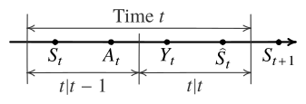

## From perfect to imperfect observations

Recall the general multi-stage model from the dynamic programming lecture. The system is driven by controlled inputs $A_t$ and primitive random variables $W_t$, and produces observations
$$
  Y_t = f_t(A_{1:t-1}, W_{0:t-1}), \quad t \ge 1,
$$
realized in the order
$$
  W_0 \;\to\; Y_1 \;\to\; A_1 \;\to\; W_1 \;\to\; Y_2 \;\to\; A_2 \;\to\; \cdots \;\to\; Y_T \;\to\; A_T \;\to\; W_T.
$$
There we assumed **perfect observations**: when choosing $A_t$, the agent had access not only to past observations and actions, but also to the primitive random variables realized so far. In that case the decision maker's information was
$$
  H_t = (Y_{1:t}, A_{1:t-1}, W_{0:t-1}),
$$
and a policy was a map $A_t = π_t(H_t)$.

We now drop the perfect observation assumption and assume that the primitive random variables $\{W_t\}_{t=0}^T$ are **not** observed. The only data available to the agent at time $t$ are the observations and actions taken so far. We continue to use $H_t$ to denote the history of the information available to the decision maker (but the value of $H_t$ is different from the perfect information case):
\begin{equation}\label{eq:pomdp-history}
  H_t = (Y_{1:t}, A_{1:t-1}).
\end{equation}
Thus $H_t$ means “information available to the agent when choosing $A_t$”. In this case, the history updates is
$$
  H_{t+1} = (H_t, A_t, Y_{t+1}),
  \quad
  Y_{t+1} = f_{t+1}(A_{1:t}, W_{0:t}),
$$
which we again write schematically as $H_{t+1} = F_t(H_t, A_t, W_t)$ when convenient, with the understanding that the agent does not observe $W_t$.

A policy is still a sequence $π = (π_1,\dots,π_T)$ with
$$
  A_t = π_t(H_t),
$$
but now $π_t$ is a function of the history given by~\eqref{eq:pomdp-history}. As before, we assume that there is a terminal cost 
$$
  C(O_T), \quad \text{where } O_T = (H_T, A_T, W_T).
$$
The performance of a policy is still
$$
   J(π) = \EXP^π[ C(O_T) ].
$$

### Information sets

To see what imperfect observations do to the decision tree, it helps to distinguish two objects.

- A **trajectory** records everything that happened, including the unobserved primitive random variables: $(Y_{1:t}, A_{1:t-1}, W_{0:t-1})$, or equivalently the full path of primitive random variables and decisions up to time $t$.
- The **history** $H_t$ is a **function** of that trajectory. Many trajectories can induce the same $H_t$.

Fix a history $h_t$. The corresponding **information set** is the collection of all trajectories that produce $H_t = h_t$. On the extensive-form tree, this is a set of decision nodes that the agent cannot tell apart: every node in the set displays the same past observations and actions, and therefore must be assigned the **same** action. Equivalently, a policy $π_t$ is well-defined on information sets, not on individual trajectories.

Under perfect observations (lecture 2), each information set was a singleton: knowing $W_{0:t-1}$ separated the trajectories completely. Under imperfect observations, information sets are typically larger, and the agent must optimize without knowing which trajectory inside the set is the true one.

### Example: inventory with a latent demand

Consider the @exm-inventory model from lecture 2, but let's assume that the distribution of the demand depends on a latent random variable $W_0 \in \{L, H\}$ that is not observed which determines whether the demand is low or high. In particular, the distribution of the demand is given by:
$$
  P(W_t = 5 \mid W_0 = L) = \tfrac34,
  \quad
  P(W_t = 5 \mid W_0 = H) = \tfrac14.
$$
The dynamics and action sets are as before: $S_1 = 0$, $A_t \in \{5,10\}$, and $S_{t+1} = S_t + A_t - W_t$. The agent observes the stock, so $Y_t = S_t$ and
$$
  H_t = (S_{1:t}, A_{1:t-1}),
$$
but does **not** observe $W_0$. Cost is incurred only at the end: each leaf of the tree carries a terminal cost $C$ that depends on the full outcome $(S_{1:3}, A_{1:2}, W_{1:2})$, as in lecture 2.

The corresponding extensive-form tree is shown in @fig-inventory-latent-infosets.

{#fig-inventory-latent-infosets}

Each dashed rounded rectangle in the figure is an information set: the agent must play the **same** action at every decision node inside it.

**Perfect recall and refinement.** Think of the sample space as generated by the primitive random variables $\{W_t\}_{t=0}^{T}$ together with the agent's choices $\{A_t\}_{t=1}^{T}$. For any fixed policy $π$, every observable quantity, including $Y_t$ and $H_t$, is a function of that full collection. At time $t$ the agent sees only $H_t$, so the relevant object is the set of all outcomes (full trajectories) that are **consistent with the current observations**. Perfect recall means the agent never forgets past observations or actions, so $H_t$ is nested in $H_{t+1}$: every outcome consistent with $H_{t+1}$ was already consistent with $H_t$, but not conversely. As time progresses, that set of consistent outcomes is successively **refined** (split into smaller subsets). The information set attached to a realized history $h_t$ is exactly the collection of outcomes still consistent with $H_t = h_t$.

## History-based dynamic programming

The history DP of lecture 2 still applies when agent does not have perfect observation and history $H_t$ is as defined in \eqref{eq:pomdp-history}. We show this dynamic programming decomposition, first for the setting with terminal cost and then later specialize to the additive cost  case.

### Terminal cost

Consider the model described above with terminal cost $C_T(O_T)$. Given any history dependent policy $π = (π_1, \dots, π_T)$, we can evaluate the performance of the policy as follows. Define
$$
  V^π_t(h_t) = \EXP^{π}[ C_T(O_T) \mid H_t = h_t ]
$$
On @fig-inventory-latent-infosets, the conditioning $H_T = h_T$ means: restrict attention to the (dashed) information set labeled by $h_T$, and average across the linked nodes on the two copies with the correct posterior weights.

We can show that these value functions satisfy the following recursion:
\begin{align*}
  V^π_t(h_t)  &= 
  \EXP^π\bigl[ \EXP^π [ C_T(O_T) \mid H_{t+1} ] \mid H_t = h_t \bigr]
  \\
  &= \EXP^π[ V_{t+1}(H_{t+1}) \mid H_t = h_t ]
\end{align*}
where we have used the smoothing property of conditional expectation. 

As we did in the fully observed case, we rewrite this recursion in two steps:
\begin{align*}
  Q^π_T(h_T, a_T)
  &= \EXP\bigl[ C(O_T) \bigm| H_T = h_T,\, A_T = a_T \bigr],
   \\
  V^π_T(h_T)
  &=  Q^π_T(h_T, π_T(h_T)),
\end{align*}
and for $t \in \{T-1, \dots, 1\}$, 
\begin{align*}
  Q^π_t(h_t, a_t)
  &= \EXP\bigl[ V^π_{t+1}(H_{t+1}) \bigm| H_t = h_t,\, A_t = a_t \bigr],
   \\
  V^π_t(h_t)
  &=  Q^π_t(h_t, π_t(h_t)),
\end{align*}

The optimal policy and value function can be obtained by a similar dynamic program, by replacing the policy evaluation step with a policy optimization step. In particular, initialize
\begin{align}
  Q^\star_T(h_T, a_T)
  &= \EXP\bigl[ C(O_T) \bigm| H_T = h_T,\, A_T = a_T \bigr],
  \label{eq:pomdp-QT-history} \\
  V^\star_T(h_T)
  &= \min_{a_T \in \ALPHABET A} Q^\star_T(h_T, a_T),
  \label{eq:pomdp-VT-history} \\
  π^\star_T(h_T)
  &\in \arg\min_{a_T \in \ALPHABET A} Q^\star_T(h_T, a_T).
  \label{eq:pomdp-piT-history}
\end{align}
and for $t \in \{T-1, \dots, 1\}$, recursively compute
\begin{align}
  Q^\star_t(h_t, a_t)
  &= \EXP\bigl[
    V^\star_{t+1}(H_{t+1})
    \bigm| H_t = h_t,\, A_t = a_t
  \bigr],
  \label{eq:pomdp-Qt-history} \\
  V^\star_t(h_t)
  &= \min_{a_t \in \ALPHABET A} Q^\star_t(h_t, a_t),
  \label{eq:pomdp-Vt-history} \\
  π^\star_t(h_t)
  &\in \arg\min_{a_t \in \ALPHABET A} Q^\star_t(h_t, a_t).
  \label{eq:pomdp-pit-history}
\end{align}

As in the fully observed case, we have the following.

:::{#thm-pomdp-history-dp}
#### History-based optimality
The policy $π^\star$ obtained from \eqref{eq:pomdp-QT-history}--\eqref{eq:pomdp-pit-history} is optimal: for every $π \in Π$ and every $h_t$,
$$
  V^{π^\star}_t(h_t) = V^\star_t(h_t) \le V^π_t(h_t).
$$
:::

The proof is the same backward induction as in lecture 2 (the comparison principle): at each information set $h_t$, choosing an action that minimizes $Q^\star_t(h_t,\cdot)$ and then following an optimal continuation cannot be improved by any other history-based choice.

This reduces the original functional optimization over policies to a nested sequence of parametric optimizations on histories. The difficulty is that the domain of $V^\star_t$ grows with $t$, and each conditional expectation mixes an information set. The recursion is correct but is typically intractable as the size of the history grows over time.

### Additive per-step costs

As in lecture 2, many models incur cost along the trajectory. In such models, we can write the terminal cost as a sum of per-step costs,
$$
  C(O_T) = \sum_{t=1}^T C_t,
$$
where each **per-step cost** $C_t$ is a random variable that is a (measurable) function of $(A_{1:t}, W_{0:t})$. In this case, the dynamic program is modified as follows:

Initialize $V^\star_{T+1} \equiv 0$. For $t = T,\dots,1$,
\begin{align}
  Q^\star_t(h_t, a_t)
  &= \EXP\bigl[
    C_t + V^\star_{t+1}(H_{t+1})
    \bigm| H_t = h_t,\, A_t = a_t
  \bigr],
  \label{eq:pomdp-Qt-additive} \\
  V^\star_t(h_t)
  &= \min_{a_t \in \ALPHABET A} Q^\star_t(h_t, a_t),
  \\
  π^\star_t(h_t)
  &\in \arg\min_{a_t \in \ALPHABET A} Q^\star_t(h_t, a_t).
\end{align}
Relative to the terminal-cost recursion, the only change is that $C_t$ is charged inside the same conditional expectation as the continuation. The optimality statement of @thm-pomdp-history-dp is unchanged.

## Information state

The history DP is correct but the domain of $V^\star_t$ grows with $t$. In the case of full observation, we showed that if the model satisfies certain properties, we can obtain a more compact dynamic program in terms of a state. The same idea works for partial observation as well.

:::{.callout-tip}
#### Information state

Let $\{\ALPHABET Z_t\}_{t=1}^T$ be a collection of Banach spaces. A collection of **history compression functions** $\{σ_t\}_{t=1}^T$, with $σ_t \colon \ALPHABET H_t \to \ALPHABET Z_t$, is called an **information state generator** if the process $\{Z_t\}_{t=1}^T$ with $Z_t = σ_t(H_t)$ satisfies the following:

**P1. Sufficient for performance evaluation.** For every $h_t$ and $a_t$,
$$
  \EXP^π\bigl[ C_t \bigm| H_t = h_t,\, A_t = a_t \bigr]
  = \EXP\bigl[ C_t \bigm| Z_t = σ_t(h_t),\, A_t = a_t \bigr]
$$
where the right hand side does not depend on $π$.

**P2. Sufficient to predict itself.** For every Borel set $B \subseteq \ALPHABET Z_{t+1}$,
$$
  \PR^π\bigl(Z_{t+1} \in B \bigm| H_t = h_t,\, A_t = a_t \bigr)
  = \PR\bigl(Z_{t+1} \in B \bigm| Z_t = σ_t(h_t),\, A_t = a_t \bigr)
$$
where the right hand side does not depend on $π$.

We will use the phrase "let $\{Z_t\}_{t=1}^T$ be an information state" to mean an information state together with its generator $\{σ_t\}_{t=1}^T$. There is no a priori restriction on the spaces $\{\ALPHABET Z_t\}$, but an information state is useful in practice only when these spaces are small in an appropriate sense.
:::

Property (P1) says that $Z_t$ is a sufficient statistic for the current cost. Property (P2) says the same for the law of the next summary. Together they imply that the conditional expectations in the history DP depend on $h_t$ only through $σ_t(h_t)$, so one can write a dynamic program on $\{\ALPHABET Z_t\}$ rather than on histories.

:::{#thm-info-state-dp}
#### Information-state dynamic program
Let $\{Z_t\}_{t=1}^T$ be an information state, with $Z_t = σ_t(H_t)$. Define $\hat V^\star_{T+1} \equiv 0$ and, for $t = T,\dots,1$,
\begin{align}
  \hat Q^\star_t(z_t, a_t)
  &= \EXP\bigl[
    C_t + \hat V^\star_{t+1}(Z_{t+1})
    \bigm| Z_t = z_t,\, A_t = a_t
  \bigr],
  \label{eq:pomdp-Qt-info} \\
  \hat V^\star_t(z_t)
  &= \min_{a_t \in \ALPHABET A} \hat Q^\star_t(z_t, a_t).
  \label{eq:pomdp-Vt-info}
\end{align}
Then for every history $h_t$ and action $a_t$,
$$
  Q^\star_t(h_t, a_t) = \hat Q^\star_t\bigl(σ_t(h_t), a_t\bigr),
  \quad
  V^\star_t(h_t) = \hat V^\star_t\bigl(σ_t(h_t)\bigr).
$$
Consequently, any policy of the form $π_t = \hat π_t \circ σ_t$ with
$$
  \hat π_t(z_t) \in \arg\min_{a_t} \hat Q^\star_t(z_t, a_t)
$$
is optimal for the original problem. Policy evaluation uses the same recursion with the prescribed action in place of the $\min$.
:::

:::{.callout-note collapse="true"}
#### Proof
Proceed by backward induction. The claim is vacuous at time $T+1$. Assume $V^\star_{t+1}(h) = \hat V^\star_{t+1}(σ_{t+1}(h))$ for all $h$. Then
\begin{align*}
  Q^\star_t(h_t, a_t)
  &= \EXP\bigl[
    C_t + V^\star_{t+1}(H_{t+1})
    \bigm| H_t = h_t,\, A_t = a_t
  \bigr]
  \\
  &= \EXP\bigl[
    C_t + \hat V^\star_{t+1}(Z_{t+1})
    \bigm| H_t = h_t,\, A_t = a_t
  \bigr]
  \\
  &= \EXP\bigl[
    C_t + \hat V^\star_{t+1}(Z_{t+1})
    \bigm| Z_t = σ_t(h_t),\, A_t = a_t
  \bigr]
  \\
  &= \hat Q^\star_t\bigl(σ_t(h_t), a_t\bigr),
\end{align*}
where the second step is the induction hypothesis (and $Z_{t+1} = σ_{t+1}(H_{t+1})$), and the third step uses (P1) and (P2). Minimizing over $a_t$ gives the claim for $V^\star_t$.
:::

Thus an information state plays the role that the Markov state played in lecture 2: once $Z_t$ is known, the past history is irrelevant for optimal decisions.

### Sufficient conditions for (P2)

Property (P1) is usually easy to check. Property (P2) can be more abstract. For many models it is easier to verify the following stronger pair of conditions instead of (P2).

:::{.callout-tip}
#### Sufficient conditions for (P2)
**P2a. State-like update.** There exist maps $φ_t$ such that
$$
  Z_{t+1} = φ_t(Z_t, A_t, Y_{t+1}).
$$

**P2b. Sufficient for the next observation.** For every Borel set $B \subseteq \ALPHABET Y$,
$$
  \PR^π\bigl(Y_{t+1} \in B \bigm| H_t = h_t,\, A_t = a_t \bigr)
  = \PR\bigl(Y_{t+1} \in B \bigm| Z_t = σ_t(h_t),\, A_t = a_t \bigr).
$$
where the right hand side does not depend on $π$.
:::

:::{#prp-info-state-P2}
#### (P2a) and (P2b) imply (P2)
If $Z_t = σ_t(H_t)$ satisfies (P2a) and (P2b), then it satisfies (P2).
:::

:::{.callout-note collapse="true"}
#### Proof
For any Borel set $B \subseteq \ALPHABET Z_{t+1}$,
\begin{align*}
  \hskip 2em & \hskip -2em
  \PR(Z_{t+1} \in B \mid H_t = h_t,\, A_t = a_t)
  = \sum_{y} \IND\{φ_t(σ_t(h_t), a_t, y) \in B\}
  \,
  \PR(Y_{t+1} = y \mid H_t = h_t,\, A_t = a_t)
  \\
  &= \sum_{y} \IND\{φ_t(σ_t(h_t), a_t, y) \in B\}
  \,
  \PR(Y_{t+1} = y \mid Z_t = σ_t(h_t),\, A_t = a_t)
  \\
  &= \PR(Z_{t+1} \in B \mid Z_t = σ_t(h_t),\, A_t = a_t),
\end{align*}
where the first step uses (P2a), the second uses (P2b), and the third rewrites the same sum as a conditional probability on $Z$.
:::

The conditions (P2a) and (P2b) are **strictly stronger** than (P2). Consider an MDP whose state is a pair $(S^1_t, S^2_t)$, the two components evolve conditionally independently given the action,
$$
  \PR(S^1_{t+1}, S^2_{t+1} \mid S^1_t, S^2_t, A_t)
  = \PR(S^1_{t+1} \mid S^1_t, A_t)\,
  \PR(S^2_{t+1} \mid S^2_t, A_t),
$$
and the per-step cost depends only on $(S^1_t, A_t)$. Then $Z_t = S^1_t$ satisfies (P1) and (P2), so it is an information state, but it does **not** satisfy (P2b): predicting the next observation $(S^1_{t+1}, S^2_{t+1})$ requires $S^2_t$ as well. (This is an instance of the Noisy-TV / irrelevant-component phenomenon.)

## Examples of information states

Nontrivial information states are model-dependent. The following gallery records several standard cases; each yields an exact dynamic program via @thm-info-state-dp. For items that reduce to a belief, the verification uses that the belief is an information state (proved in the next subsection).

1. **History.** Take $σ_t$ to be the identity, so $Z_t = H_t$. Then @thm-info-state-dp reduces to the history DP.

   :::{.callout-note collapse="true"}
   #### Verification

   (P1) and (P2) hold because conditioning on $Z_t$ is the same as conditioning on $H_t$.
   :::

2. **MDP.** With perfect state observation $Y_t = S_t$ and additive cost $C_t = c_t(S_t, A_t, W_t)$, set $σ_t(H_t) = S_t$. This recovers the Markov DP of lecture 2.

   :::{.callout-note collapse="true"}
   #### Verification

   **(P1):** $\EXP[C_t \mid H_t, A_t] = \EXP[c_t(S_t, A_t, W_t) \mid S_t, A_t]$.

   **(P2a)--(P2b):** $S_{t+1} = f_t(S_t, A_t, W_t)$ and $Y_{t+1} = S_{t+1}$, so the next state (hence the next observation) is predicted from $(S_t, A_t)$ alone.
   :::

3. **Irrelevant component.** In the Noisy-TV example above, $Z_t = S^1_t$ is an information state even though the agent observes the full state $(S^1_t, S^2_t)$.

   :::{.callout-note collapse="true"}
   #### Verification

   **(P1):** the cost depends only on $(S^1_t, A_t)$.

   **(P2):** $S^1_{t+1}$ evolves from $(S^1_t, A_t)$ independently of $S^2_t$, so the law of $Z_{t+1}$ given $(H_t, A_t)$ equals the law given $(S^1_t, A_t)$.
   :::

4. **Delayed state observation.** If the agent observes the state with delay $δ$, so $Y_t = S_{t-δ+1}$, take $Z_t = (S_{t-δ+1}, A_{t-δ+1:t-1})$.

   :::{.callout-note collapse="true"}
   #### Verification

   **(P1):** the current cost, given the delayed state and the intervening actions, does not depend on older data.

   **(P2a)--(P2b):** appending $A_t$ and the next delayed observation $Y_{t+1} = S_{t-δ+2}$ updates $Z_t$ to $Z_{t+1}$ by a deterministic shift of the window, and the law of $Y_{t+1}$ is determined by the controlled chain started from $S_{t-δ+1}$ under $A_{t-δ+1:t}$.
   :::

5. **Latent demand (belief on $W_0$).** In the inventory example above (@fig-inventory-latent-infosets), take $Z_t = (S_t, \PR(W_0 \mid H_t))$. In a general POMDP (see the next subsection) the same idea yields the belief $b_t = \PR(S_t \mid H_t)$.

   :::{.callout-note collapse="true"}
   #### Verification

   **(P1):** given the observed stock and the posterior on $W_0$, the conditional expected cost (and the law of future demand) does not depend on further details of $H_t$.

   **(P2a)--(P2b):** Bayes updates the posterior on $W_0$ from the next observed stock $S_{t+1}$, and $S_{t+1} = S_t + A_t - W_t$ has a predictive law determined by $(S_t, A_t)$ and that posterior.
   :::

6. **LQG.** For linear dynamics, linear observations, Gaussian noise, and quadratic cost, the conditional mean $Z_t = \EXP[S_t \mid H_t]$ is an information state. Certainty equivalence is taken up in lecture 9.

   :::{.callout-note collapse="true"}
   #### Verification

   Using the belief: $b_t = \PR(S_t \mid H_t)$ is Gaussian and therefore summarized by its mean (and a covariance that evolves independently of the observations). Quadratic cost depends on $b_t$ only through the mean, and the Kalman filter is the (P2a) update of that mean.
   :::

7. **Machine maintenance.** A machine has ordered quality states; at each time the agent may run it or stop to inspect (then repair or replace). Let $τ$ be the time of the last inspection/repair/replacement and $S_τ$ the state just after that intervention. Then $Z_t = (S_τ,\, t - τ)$ is an information state.

   :::{.callout-note collapse="true"}
   #### Verification

   Using the belief: between interventions the quality belief is the $t-τ$ step pushforward of a point mass at $S_τ$, so $b_t$ is a deterministic function of $(S_τ, t-τ)$; after inspect/repair/replace the belief resets to a point mass and the clock restarts. Thus $(S_τ, t-τ)$ is a sufficient compression of $b_t$, hence an information state.
   :::

## Standard POMDPs and belief states

Specialize the general input–output system to a **hidden state** $S_t \in \ALPHABET S$. The primitive random variables are independent, the state evolves as
$$
  S_{t+1} = f_t(S_t, A_t, W_t),
$$
and the observation is a noisy function of the current state,
$$
  Y_t = \ell_t(S_t, N_t),
$$
with observation noise $N_t$ (also a primitive random variable). The agent still only sees $H_t = (Y_{1:t}, A_{1:t-1})$. The per-step cost is a random variable of the form $C_t = c_t(S_t, A_t)$.

Define the **belief** $b_t \in Δ(\ALPHABET S)$ by
$$
  b_t(s) = \PR(S_t = s \mid H_t).
$$
Write $b_t[h_t]$ when the dependence on the history should be explicit.

:::{#lem-belief-update}
#### Belief update
There is a (policy-independent) map $φ_t$ such that
$$
  b_{t+1} = φ_t(b_t, A_t, Y_{t+1}).
$$
Explicitly, for finite $\ALPHABET S$,
$$
  b_{t+1}(s')
  = \frac{
    \sum_{s} \PR(Y_{t+1} \mid s') \, \PR(s' \mid s, A_t) \, b_t(s)
  }{
    \sum_{s,s''} \PR(Y_{t+1} \mid s'') \, \PR(s'' \mid s, A_t) \, b_t(s)
  }.
$$
:::

:::{.callout-note collapse="false"}
#### Proof
For any $s' \in \ALPHABET S$,
\begin{align*}
  b_{t+1}(s')
  &= \PR(S_{t+1} = s' \mid Y_{1:t+1}, A_{1:t})
  \\
  &= \sum_{s} \PR(S_t = s,\, S_{t+1} = s' \mid Y_{1:t+1}, A_{1:t})
  \\
  &= \frac{
    \sum_{s}
    \PR(S_t = s,\, S_{t+1} = s',\, Y_{t+1}, A_t \mid Y_{1:t}, A_{1:t-1})
  }{
    \sum_{s,s''}
    \PR(S_t = s,\, S_{t+1} = s'',\, Y_{t+1}, A_t \mid Y_{1:t}, A_{1:t-1})
  }.
\end{align*}
The joint factor in the sums is
\begin{align*}
  &\PR(S_t = s,\, S_{t+1} = s',\, Y_{t+1}, A_t \mid Y_{1:t}, A_{1:t-1})
  \\
  &= \PR(Y_{t+1} \mid S_{t+1} = s')\,
  \PR(S_{t+1} = s' \mid S_t = s,\, A_t)\,
  \IND\{A_t = π_t(Y_{1:t}, A_{1:t-1})\}\,
  b_t(s).
\end{align*}
Substituting into the numerator and the denominator, the indicator $\IND\{A_t = π_t(H_t)\}$ is common to every term and cancels. The resulting expression depends on the history only through $(b_t, A_t, Y_{t+1})$, which is the claimed update.
:::

:::{#lem-belief-policy-independent}
#### Beliefs do not depend on the policy
The conditional law $b_t[h_t]$ is the same for every policy $π$ that is consistent with the realized actions in $h_t$.
:::

:::{.callout-note collapse="true"}
#### Proof
Indeed, $b_1$ is the Bayesian update of the prior given $Y_1$, which does not involve $π$, and @lem-belief-update gives $b_{t+1} = φ_t(b_t, A_t, Y_{t+1})$ with a map $φ_t$ that does not depend on $π$. Iterating, $b_t$ is a function of $(Y_{1:t}, A_{1:t-1})$ alone. See also @Witsenhausen1975.
:::

#### Belief is an information state
An immediate implication of the definition of belief is that
$$
  \EXP\bigl[C_t \bigm| H_t = h_t,\, A_t = a_t\bigr]
  = \sum_{s} c_t(s,a_t)\, b_t[h_t](s),
$$
where the right hand side does not depend on the policy due to @lem-belief-policy-independent. Thus, beliefs satisfy (P1).

(P2a) is @lem-belief-update. For (P2b), the predictive law of the next observation depends on the history only through $(b_t, A_t)$:
$$
  \PR\bigl(Y_{t+1} = y \bigm| H_t = h_t,\, A_t = a_t\bigr)
  = \sum_{s,s'}
  \PR(Y_{t+1} = y \mid S_{t+1} = s')\,
  \PR(S_{t+1} = s' \mid S_t = s,\, A_t = a_t)\,
  b_t[h_t](s).
$$
The right hand side is a function of $(b_t[h_t], a_t, y)$ alone (and does not depend on $π$, by @lem-belief-policy-independent), which is (P2b).

:::{.callout-note}
#### Remark
For finite-horizon POMDPs with $C_t = c_t(S_t, A_t)$, the optimal value $\hat V^\star_t(b)$ is a **concave** function of the belief $b$. Concavity is the structural property behind classical exact POMDP solvers; we do not develop those algorithms here.
:::

## When to observe a Markov chain

Consider a time-homogeneous finite-state Markov chain $(S_t)_{t \ge 1}$, $S_t \in \ALPHABET S$, with transition matrix $P$. A remotely located estimator wants to track the chain, but observations are costly. At each $t$ the estimator takes two decisions:

- First, whether to observe the current state. If $A_t = 1$, it pays $λ$ and sees $Y_t = S_t$; if $A_t = 0$, it pays nothing and the observation is blank, $Y_t = \BLANK$.
- Then, it produces an estimate $\hat S_t \in \ALPHABET S$ and incurs distortion $d(S_t, \hat S_t)$, where $d \colon \ALPHABET S × \ALPHABET S \to \reals$.

The per-step cost is
$$
  c(s, a, \hat s) = λ a + d(s, \hat s).
$$

{#fig-when-to-observe-timing}

At time $t$ the underlying state is $S_t$. The estimator first chooses $A_t$ (stage $t|t-1$), then chooses $\hat S_t$ (stage $t|t$). Neither decision affects the transition of the chain: after stage $t|t$, the state evolves to $S_{t+1}$ according to $P$. The histories available at the two stages are
\begin{align*}
  H_{t|t-1} &= (Y_{1:t-1}, A_{1:t-1}, \hat S_{1:t-1}),
  \\
  H_{t|t} &= (Y_{1:t}, A_{1:t}, \hat S_{1:t-1}),
\end{align*}
with policies $A_t = π_{t|t-1}(H_{t|t-1})$ and $\hat S_t = π_{t|t}(H_{t|t})$. The objective is to minimize $\EXP\bigl[\sum_{t=1}^T c(S_t, A_t, \hat S_t)\bigr]$.

### Belief as an information state

Define the predict and update beliefs
\begin{align*}
  b_{t|t-1}(s) &= \PR(S_t = s \mid H_{t|t-1}),
  \\
  b_{t|t}(s) &= \PR(S_t = s \mid H_{t|t}).
\end{align*}
They evolve by
$$
  b_{t|t}(s)
  = \begin{cases}
    b_{t|t-1}(s), & a_t = 0, \\
    δ_{y_t}(s), & a_t = 1,
  \end{cases}
$$
and
$$
  b_{t+1|t} = b_{t|t}\, P.
$$
Both $b_{t|t-1}$ and $b_{t|t}$ are information states for their respective decision stages (the argument is the same as for the standard POMDP belief). The corresponding dynamic program is: initialize $V_{T+1|T} \equiv 0$ and, for $t = T,\dots,1$,
\begin{align*}
  V_{t|t}(b_{t|t})
  &= D(b_{t|t}) + V_{t+1|t}(b_{t|t}\, P),
  \\
  V_{t|t-1}(b_{t|t-1})
  &= \min \Bigl\{
    V_{t|t}(b_{t|t-1}),\,
    λ + \sum_{s \in \ALPHABET S} b_{t|t-1}(s)\, V_{t|t}(δ_s)
  \Bigr\},
\end{align*}
where
$$
  D(b) \coloneqq \min_{\hat s \in \ALPHABET S} \sum_{s \in \ALPHABET S} b(s)\, d(s, \hat s)
$$
is the optimal expected distortion under belief $b$. The optimal estimate depends on $b_{t|t}$ alone.

### A countable information state

Suppose the estimator starts from a known state, so $b_{1|0} = δ_{s_1}$. Then every predict-belief reachable under the dynamics has the form
$$
  b_{t|t-1} = δ_{z_t} P^{τ_t},
$$
where $z_t$ is the state at the last observation and $τ_t$ is the time since that observation. The reachable set
$$
  \{ δ_z P^τ : z \in \ALPHABET S,\, τ \in \naturalnumbers \}
$$
is isomorphic to $\ALPHABET S × \naturalnumbers$. Thus $Z_t = (z_t, τ_t)$ is an information state, **different** from (and much smaller than) a generic point of $Δ(\ALPHABET S)$.

The corresponding dynamic program is: initialize $V_{T+1|T} \equiv 0$ and, for $t = T,\dots,1$,
\begin{align*}
  V_{t|t}(z, τ)
  &= D(δ_z P^τ) + V_{t+1|t}(z, τ+1),
  \\
  V_{t|t-1}(z, τ)
  &= \min\Bigl\{
    V_{t|t}(z, τ),\,
    λ + \sum_{s \in \ALPHABET S} [P^τ]_{z s}\, V_{t|t}(s, 0)
  \Bigr\}.
\end{align*}
This recursion lives on a countable state space and can be solved by truncating large ages $τ$.

## Notes {-}

In this lecture, we follow @Subramanian2022 for the information-state framework. The when-to-observe example is adapted from @Shuman2010.

## References {-}
